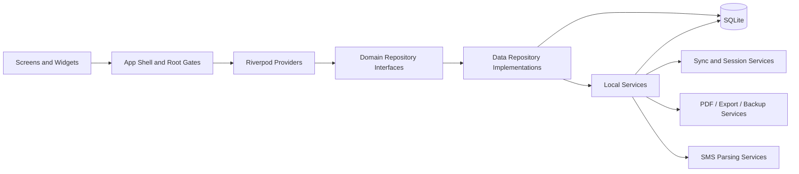
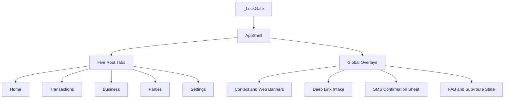

# Component Model
# KashCube

**Version:** 1.0  
**Date:** March 27, 2026  
**Status:** Current / Implementation-backed

---

## 1. Structural Overview

KashCube follows a layered local-first structure with a shell-centric runtime coordinator and a repository-based data boundary.

---

## 2. Primary Components

### 2.1 Root runtime components

| Component | Responsibility |
|---|---|
| `main()` boot sequence | initializes platform services and enters Flutter runtime |
| `KashCubeApp` | root theme/router shell and installer activation point |
| `_LockGate` | terms, setup, lock, and user-selection gating |
| `AppShell` | tabbed runtime coordinator, overlays, deep links, SMS surface, and adaptive navigation |

### 2.2 Presentation components

| Component group | Responsibility |
|---|---|
| Screens | module-level user workflows |
| Shared widgets | reusable form, list, chart, and status UI |
| Adaptive navigation chrome | `NavigationRail` or `NavigationBar` depending on screen width |

### 2.3 Provider components

| Provider group | Responsibility |
|---|---|
| Session and identity providers | owner/staff state, permission resolution, user switching |
| Settings-backed providers | theme, business mode, default account, app lock, biometric toggle |
| Installer providers | sync auto-refresh, notification scheduler, IAP listener |
| Feature providers | transactions, credits, loans, invoices, bookings, inventory, reports |

### 2.4 Data access components

| Component | Responsibility |
|---|---|
| Domain repository interfaces | stable boundary between UI/provider layer and storage logic |
| Data repository implementations | queries, mapping, persistence, and business-oriented retrieval |
| `DatabaseHelper` and schema helpers | SQLite lifecycle, migrations, indexes, and table creation |

### 2.5 Service components

| Service group | Responsibility |
|---|---|
| SMS services | parse financial SMS, dedupe, and drive confirmation flows |
| Document services | PDF generation, caching, export packaging |
| GST and invoice services | numbering, tax workflows, document generation support |
| Backup and identity services | exports, backup reminders, device identity, session trust |
| Sync services | event bus, registries, query builders, discovery, pairing, merge |

---

## 3. Shell-Centric Composition

The shell is not a thin router. It is a runtime coordinator responsible for navigation, access checks, overlay orchestration, and app-wide interaction surfaces.

---

## 4. Component Boundaries

### 4.1 What presentation may do

- render state
- issue user intents
- invoke navigation and sheets
- observe provider state and runtime signals

### 4.2 What presentation should not own

- raw SQL
- persistent sync bookkeeping
- long-lived cross-feature installation logic
- direct manipulation of trust, identity, or session persistence

### 4.3 What repositories own

- persistence semantics
- cross-table reads and writes
- mapping between DB rows and domain models
- feature-specific transactional consistency

### 4.4 What services own

- system integrations
- device and browser companion coordination
- document generation and cache handling
- sync orchestration and merge support

---

## 5. Architectural Style Summary

KashCube uses a hybrid of:

- layered architecture
- MVVM-style reactive presentation with Riverpod
- repository pattern for persistence separation
- shell-first runtime composition
- event-driven refresh for sync consistency

---

## 6. Traceability

This model is seeded from:

- `docs/codebase/ARCHITECTURE_AS_BUILT.md`
- `docs/codebase/architecture/APP_SHELL_AND_NAVIGATION_AS_BUILT.md`
- `docs/codebase/architecture/STATE_AND_DATAFLOW_ARCHITECTURE_AS_BUILT.md`
- `docs/codebase/architecture/BOOT_AND_STARTUP_AS_BUILT.md`