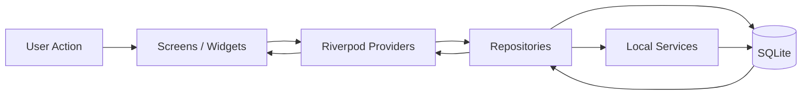
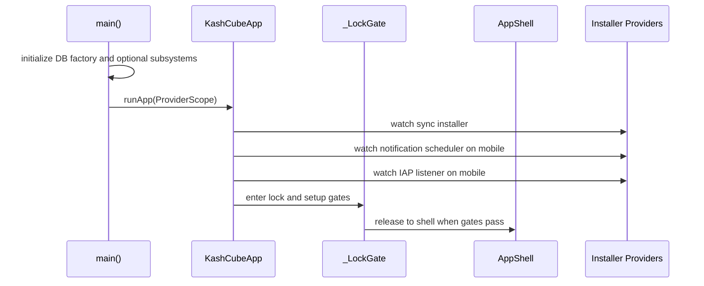
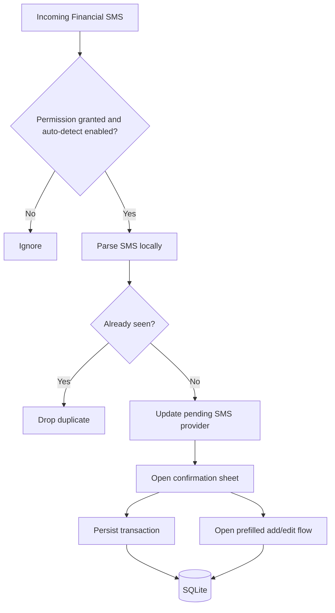
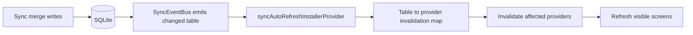
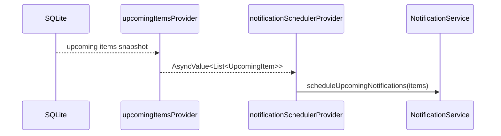
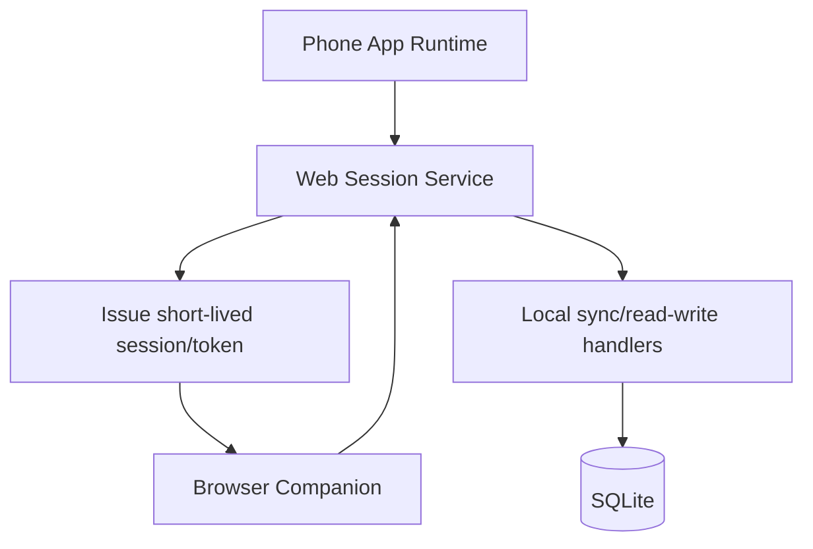
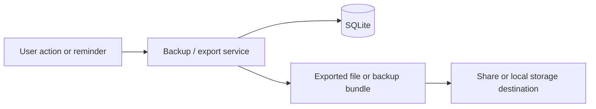

# Data Flow Diagrams
# KashCube

**Version:** 1.0  
**Date:** March 27, 2026  
**Status:** Current / Implementation-backed

---

## 1. Overview

This document captures the major runtime data flows that matter architecturally.

The diagrams focus on where authoritative state lives, how state becomes visible in UI, and how device-local integrations are mediated.

---

## 2. Core Application Data Flow

### Notes

- SQLite remains the authoritative state store.
- Providers expose view state and async data to presentation.
- Services participate when a workflow crosses system boundaries such as SMS, documents, sync, or notifications.

---

## 3. Startup And Runtime Installation Flow

---

## 4. SMS Capture And Confirmation Flow

### Notes

- Financial SMS parsing is local-only.
- The user remains in control through confirm or edit flows.
- The runtime shell owns the user-facing confirmation surface.

---

## 5. Sync Refresh Flow

### Notes

- Sync writes are not assumed to pass through screen-level state notifiers.
- The invalidation map is the refresh bridge from storage mutation to visible UI.

---

## 6. Notification Scheduling Flow

---

## 7. Browser Companion Flow

### Notes

- The browser companion is device-mediated, not backend-mediated.
- Session issuance originates from the local app runtime.

---

## 8. Backup And Export Flow

---

## 9. Architectural Invariants

1. Business data must remain recoverable from local storage.
2. UI freshness after sync depends on provider invalidation, not widget-local state.
3. External inputs such as SMS and browser sessions enter through controlled service boundaries.
4. Cross-cutting runtime actions are installed once at the root, not ad hoc per screen.

---

## 10. Traceability

Seeded from:

- `docs/codebase/architecture/BOOT_AND_STARTUP_AS_BUILT.md`
- `docs/codebase/architecture/STATE_AND_DATAFLOW_ARCHITECTURE_AS_BUILT.md`
- `docs/codebase/architecture/RUNTIME_CROSS_CUTTING_AS_BUILT.md`
- `docs/codebase/SMS_PIPELINE_AS_BUILT.md`
- `docs/codebase/SYNC_AND_IDENTITY_AS_BUILT.md`