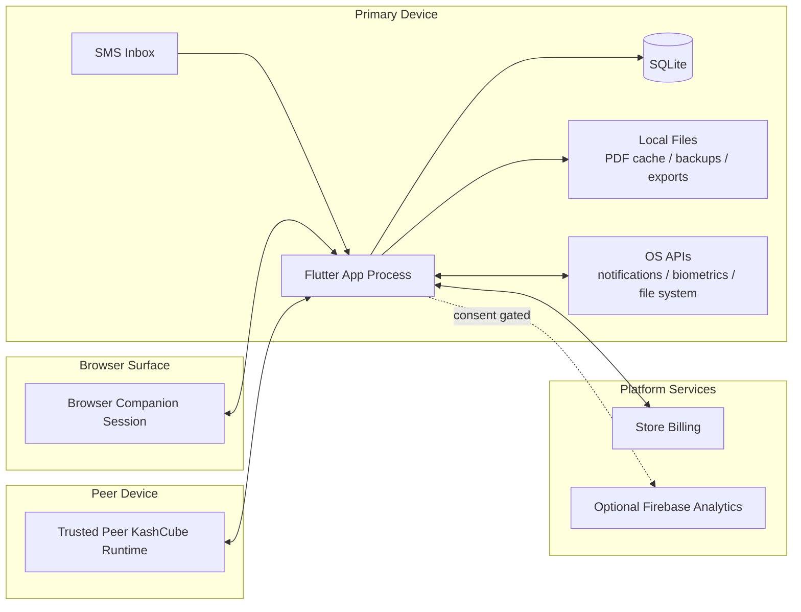

# Deployment And Runtime Topology
# KashCube

**Version:** 1.0  
**Date:** March 27, 2026  
**Status:** Current / Implementation-backed

---

## 1. Overview

KashCube is deployed primarily as a device-local application runtime. Its topology is best understood as local process boundaries plus optional adjacent surfaces rather than cloud-hosted environments.

---

## 2. Topology Diagram

---

## 3. Runtime Nodes

### 3.1 Primary app runtime

The Flutter process owns:

- UI rendering
- provider graph lifecycle
- repository orchestration
- DB access
- notification scheduling
- lock and session gates
- companion and peer session control

### 3.2 Local persistence node

SQLite stores operational business state, while local files hold PDFs, exports, backup artifacts, and temporary generated content.

### 3.3 Browser companion node

The browser is an attached surface controlled by the phone or primary runtime. It is not the system of record.

### 3.4 Peer device node

Peer devices participate in local sync and trust relationships. They are separate authorities for their own local stores, but not centralized coordinators.

---

## 4. Deployment Characteristics

| Characteristic | Current shape |
|---|---|
| Primary deployment | device-local Flutter app |
| Authoritative data store | local SQLite |
| Required backend | none |
| Companion surface | browser companion session |
| Multi-device topology | explicit peer-to-peer or linked session model |
| Offline behavior | core workflows continue locally |
| Startup dependencies | optional platform integrations only |

---

## 5. Process Lifecycle Considerations

### 5.1 Startup

- initialize platform services defensively
- install cross-cutting providers at root
- pass through lock/setup/user gates
- enter app shell

### 5.2 Pause/resume

- checkpoint SQLite WAL on pause
- re-check lock state on resume
- evict stale PDF cache on resume

### 5.3 Foreground runtime

- shell manages deep links, SMS confirmations, and navigation overlays
- provider graph reacts to storage and sync-driven invalidations

---

## 6. Deployment Constraints

1. The design must preserve privacy-first local data residency.
2. New runtime surfaces must not imply mandatory server ownership.
3. Any companion or peer topology must remain subordinate to the local data model.
4. Optional analytics and purchase flows must stay bounded and non-authoritative.

---

## 7. Traceability

Derived from:

- `docs/codebase/architecture/BOOT_AND_STARTUP_AS_BUILT.md`
- `docs/codebase/architecture/APP_SHELL_AND_NAVIGATION_AS_BUILT.md`
- `docs/codebase/architecture/RUNTIME_CROSS_CUTTING_AS_BUILT.md`
- `docs/codebase/SYNC_AND_IDENTITY_AS_BUILT.md`