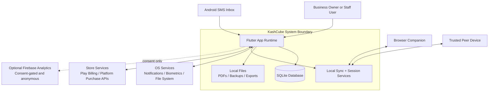

# System Context
# KashCube

**Version:** 1.0  
**Date:** March 27, 2026  
**Status:** Current / Implementation-backed

---

## 1. Purpose

This document defines KashCube's system boundary, external actors, trust boundaries, and the surrounding systems it interacts with.

KashCube is not a server-centric SaaS. It is a local-first Flutter application whose primary system of record is the user's local SQLite database, with optional local-network and browser-companion surfaces.

---

## 2. System Boundary

KashCube includes:

- Flutter application runtime
- local SQLite database and on-device file storage
- Riverpod provider graph and repositories
- local services for SMS parsing, documents, notifications, backup, and sync orchestration
- local-device identity and trust material
- browser companion and peer-sync sessions initiated by the device

KashCube explicitly excludes:

- KashCube-operated backend servers
- cloud-hosted business data storage
- remote sync infrastructure controlled by KashCube
- mandatory accounts or always-online authentication

---

## 3. Context Diagram

---

## 4. External Actors And Systems

### 4.1 Primary human actors

| Actor | Role |
|---|---|
| Owner | Full-access user operating the local business ledger |
| Staff user | Permission-scoped user selected through app-user session flow |
| Browser operator | User accessing the web companion via device-issued session |

### 4.2 External systems and interfaces

| External system | Why KashCube uses it | Notes |
|---|---|---|
| Android SMS subsystem | local transaction capture | financial SMS is parsed on-device only |
| Local OS notification APIs | reminders and upcoming item alerts | app-owned scheduling, no remote push required |
| Local biometric APIs | convenience unlock | fallback remains local PIN |
| Platform purchase APIs | optional subscription purchase handling | platform-managed commerce, not KashCube backend |
| Firebase analytics | optional anonymous analytics | gated by explicit consent and must not include financial data |
| Browser on same user workflow | browser companion access | session is device-mediated |
| Peer device on LAN | local sync | trust and pairing are explicit and local |

---

## 5. Trust Boundaries

### 5.1 Strongly trusted boundary

Inside the device boundary:

- SQLite data
- settings and session state
- app-user and permission state
- generated documents and exported files
- cryptographic identity and pairing state

### 5.2 Conditionally trusted boundary

Browser companion and peer devices are trusted only after an explicit session or pairing flow.

### 5.3 Minimally trusted boundary

Platform services may be used for notifications, biometrics, and billing, but KashCube does not delegate financial state ownership to them.

### 5.4 Non-goal boundary

There is no KashCube cloud control plane. Architectural decisions should continue to assume that the app must function even when no internet path exists.

---

## 6. Architectural Implications

1. Local persistence is the authoritative data store.
2. Network-dependent designs must remain optional, bounded, and privacy-compatible.
3. Identity, permissions, and sync are device-mediated concerns, not backend-account concerns.
4. Session establishment for browser or peer access must preserve the local-first trust model.
5. Startup and daily operation must tolerate optional subsystem failure without blocking core bookkeeping workflows.

---

## 7. Traceability

This context is derived from:

- `docs/codebase/ARCHITECTURE_AS_BUILT.md`
- `docs/codebase/SYNC_AND_IDENTITY_AS_BUILT.md`
- `docs/codebase/architecture/BOOT_AND_STARTUP_AS_BUILT.md`
- `docs/codebase/architecture/RUNTIME_CROSS_CUTTING_AS_BUILT.md`
- `docs/architecture/privacy/PRIVACY_ARCHITECTURE.md`