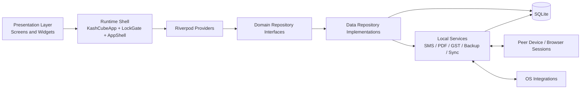

# Technical Architecture
# KashCube Software Architecture Document

**Version:** 3.0  
**Date:** March 27, 2026  
**Status:** Current / Implementation-backed

---

## 1. Purpose

This document is the formal software architecture overview for KashCube.

It consolidates the current implementation shape from the as-built documentation into a stable architectural narrative covering system structure, runtime behavior, major components, and cross-cutting constraints.

---

## 2. Architectural Summary

KashCube is a privacy-first, local-first Flutter application for financial tracking and SMB operations. Its core business state is persisted in local SQLite, surfaced through a Riverpod provider graph, and coordinated by a shell-centric runtime.

The system deliberately avoids a KashCube-operated backend for core data ownership. Browser and peer-device surfaces are attached to the local runtime rather than replacing it.

---

## 3. Architectural Principles

1. **Local-first data ownership**: the device-local database is authoritative.
2. **Privacy-first boundaries**: business data must not require KashCube cloud storage.
3. **Provider-driven runtime**: shared state, installers, and refresh behavior are modeled through Riverpod.
4. **Shell-first composition**: a single adaptive shell coordinates navigation, overlays, access checks, and runtime ingress points.
5. **Graceful degradation**: optional integrations may fail without blocking access to the core product.
6. **Documented traceability**: formal architecture is seeded from current as-built code documentation.

---

## 4. High-Level Architecture

---

## 5. Runtime View

### 5.1 Boot sequence

The runtime boot path is:

1. initialize platform and database prerequisites
2. attempt optional subsystem initialization
3. enter `ProviderScope`
4. install root runtime providers
5. evaluate terms, setup, lock, and user-selection gates
6. enter the adaptive app shell

### 5.2 Steady-state runtime

Once active, the shell coordinates:

- root tab navigation
- nested navigators per tab
- SMS confirmation intake
- deep-link and install-referrer intake
- permission-aware tab switching
- floating action behavior and overlay surfaces

### 5.3 Cross-cutting runtime systems

The root runtime also activates:

- sync-driven provider invalidation
- notification scheduling
- purchase listener wiring on supported platforms
- lifecycle safety hooks such as WAL checkpoint and PDF cache eviction

---

## 6. Data Architecture

### 6.1 Primary store

SQLite is the primary operational data store for transactions, credits, loans, invoices, parties, settings, sync metadata, and related business modules.

### 6.2 File-backed artifacts

The system also uses local files for:

- generated PDFs
- backup bundles
- exports
- temporary caches

### 6.3 Refresh model

Storage mutations become visible in the UI through provider refresh, including sync-driven invalidation via `SyncEventBus`.

---

## 7. Structural Views And Companion Documents

The formal architecture set is split into focused documents:

- `SYSTEM_CONTEXT.md`
- `COMPONENT_MODEL.md`
- `DATA_FLOW_DIAGRAMS.md`
- `DEPLOYMENT_AND_RUNTIME_TOPOLOGY.md`
- `TECHNOLOGY_STACK.md`
- `QUALITY_ATTRIBUTES.md`

Related decision records live in `../decisions/ARCHITECTURE_DECISIONS.md` and `../decisions/adr/`.

---

## 8. Architectural Risks To Manage

1. Shell complexity can accumulate because navigation, overlays, and ingress points are centralized there.
2. Sync freshness depends on disciplined provider invalidation coverage.
3. Local-first trust and privacy goals push more complexity into client-side identity, session, and merge logic.
4. Rapid schema growth requires disciplined schema documentation and migration hygiene.

---

## 9. Traceability To As-Built Evidence

This document is seeded from:

- `docs/codebase/ARCHITECTURE_AS_BUILT.md`
- `docs/codebase/architecture/BOOT_AND_STARTUP_AS_BUILT.md`
- `docs/codebase/architecture/APP_SHELL_AND_NAVIGATION_AS_BUILT.md`
- `docs/codebase/architecture/STATE_AND_DATAFLOW_ARCHITECTURE_AS_BUILT.md`
- `docs/codebase/architecture/RUNTIME_CROSS_CUTTING_AS_BUILT.md`
- `docs/codebase/DATABASE_AS_BUILT.md`
- `docs/codebase/SYNC_AND_IDENTITY_AS_BUILT.md`
