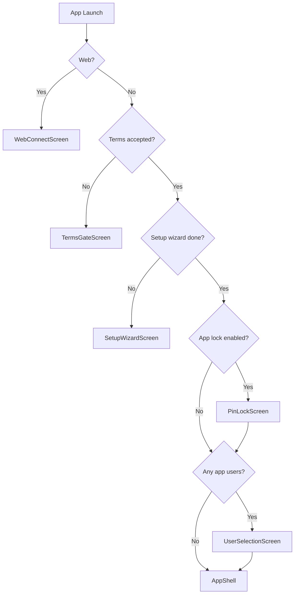
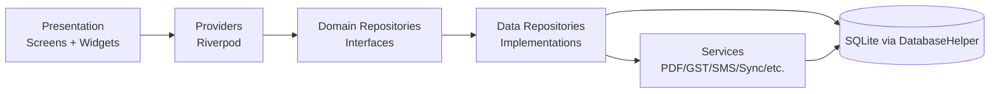

# Architecture (As-Built)

## 1) Runtime Boot Flow

The app startup path in `lib/main.dart` is:

1. Initialize Flutter + DB factory (`initDatabaseFactory`)
2. Try Firebase initialization (non-fatal)
3. Initialize local notifications (mobile only)
4. Run FY check + background job registration (mobile only)
5. Start app with `ProviderScope`
6. Gate through `_LockGate`

### Gate Sequence (`_LockGate`)

## 2) Shell and Navigation Model

`lib/presentation/app_shell.dart` runs a **5-tab shell** with **nested navigators per tab**.

- Home
- Transactions
- Business
- Contacts
- Settings

Each tab has its own `NavigatorState` key, so tab-local stacks are preserved.

### Shell Layout Behavior

- `context.isExpanded` (`>= 840dp`): `NavigationRail`
- Otherwise: `NavigationBar`
- Global FAB (`SpeedDialFab`) shown only on root routes of Home/Transactions/Business tabs

## 3) Layered Code Structure

## 4) Module Inventory (High-Level)

### Data Layer

- **56 DB tables** (finance + business + sync + identity)
- **25 repository interfaces** in domain layer
- **25 repository implementations** in data layer
- **64 service files** (sync, SMS, PDF, GST, backup, analytics, etc.)

### Presentation Layer

- **50 provider files**
- **69 screen files** across 20 feature folders

## 5) Key Architectural Decisions Visible in Code

1. **Local-first persistence**: all critical state originates in SQLite.
2. **Provider-driven orchestration**: screen logic routed through Riverpod notifiers/providers.
3. **Feature hubs**: tab hubs (`TransactionsHubScreen`, `BusinessHubScreen`) aggregate sub-flows.
4. **Context-aware shell**: deep-link handling, SMS confirmation overlays, session/permission checks in shell layer.
5. **Sync-integrated runtime**: sync auto-refresh provider is installed at app root to keep UI in sync with inbound merge events.

## 6) What Is Not “Just Docs” (Clearly Implemented)

- Staff PIN selection and user switching screens are present and wired.
- Linked-device, identity, and sync state tables are in schema.
- Web companion entry (`WebConnectScreen`) is wired in launch gate.
- FY services and notifications are actively invoked at startup.

This confirms the architecture is beyond MVP-only flows and includes production-grade local identity/sync plumbing.
