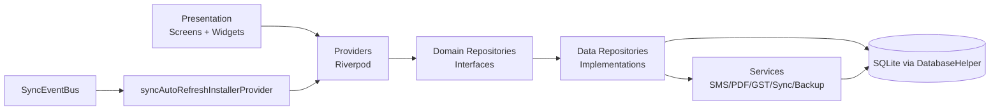

# Architecture (As-Built)

This file is the architecture overview and index.  
Detailed runtime documentation now lives under `docs/codebase/architecture/`.

## 1) Architecture Overview

Core architectural traits visible in implementation:

1. **Local-first persistence**: critical business state is SQLite-backed.
2. **Provider-orchestrated UI**: runtime wiring and feature state flow through Riverpod.
3. **Shell-first composition**: one adaptive app shell coordinates navigation + overlays.
4. **Sync-aware freshness**: sync events invalidate targeted providers to prevent stale UI.
5. **Defensive startup**: optional subsystem failures do not block `runApp()`.

---

## 2) Runtime Entry Snapshot

Startup path:

1. `main()` initialization (`WidgetsFlutterBinding`, DB factory, optional Firebase)
2. Mobile pre-init side effects (notifications, FY checks, background task registration)
3. `runApp(ProviderScope(child: KashCubeApp()))`
4. Root installers (`syncAutoRefreshInstallerProvider`, `notificationSchedulerProvider`, `iapServiceProvider`)
5. `_LockGate` gate sequence
6. `AppShell` runtime orchestration

---

## 3) Documentation Map (Detailed)

### A) Boot and startup internals
- `architecture/BOOT_AND_STARTUP_AS_BUILT.md`
  - startup sequence diagrams
  - platform branches (web vs mobile)
  - `_LockGate` lifecycle and resume behavior
  - failure tolerance matrix

### B) Shell and navigation internals
- `architecture/APP_SHELL_AND_NAVIGATION_AS_BUILT.md`
  - 5-tab shell topology
  - per-tab nested navigator strategy
  - back-press contract and tab reset behavior
  - deep link + SMS integration points

### C) State/dataflow architecture
- `architecture/STATE_AND_DATAFLOW_ARCHITECTURE_AS_BUILT.md`
  - provider/repository/service dataflow
  - sync invalidation map strategy
  - permissions/session model
  - settings control-plane role

### D) Cross-cutting runtime behavior
- `architecture/RUNTIME_CROSS_CUTTING_AS_BUILT.md`
  - lifecycle safety hooks
  - notification and sync runtime guarantees
  - reliability/failure mitigation summary

---

## 4) Inventory Anchors

- DB tables: see `DATABASE_AS_BUILT.md` and `DATABASE_INVENTORY_AUTO.md`
- Provider + screen surface: see `STATE_AND_NAVIGATION_AS_BUILT.md`
- Sync/identity topology: see `SYNC_AND_IDENTITY_AS_BUILT.md`
- Service pipelines: see Phase 3 docs (`SMS_*`, `PDF_*`, `GST_*`, `BACKUP_*`, `INVOICE_NUMBERING_*`)

---

## 5) Maintenance Rule

When architecture-impacting code changes land (boot sequence, shell behavior, provider orchestration, sync/runtime guarantees), update both:

1. this overview index (`ARCHITECTURE_AS_BUILT.md`)
2. the relevant deep-dive file in `docs/codebase/architecture/`
