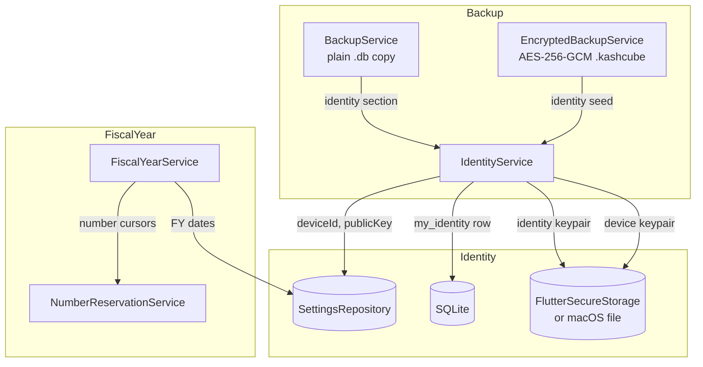
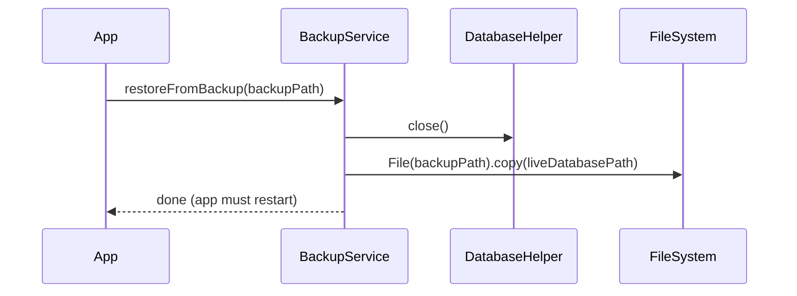
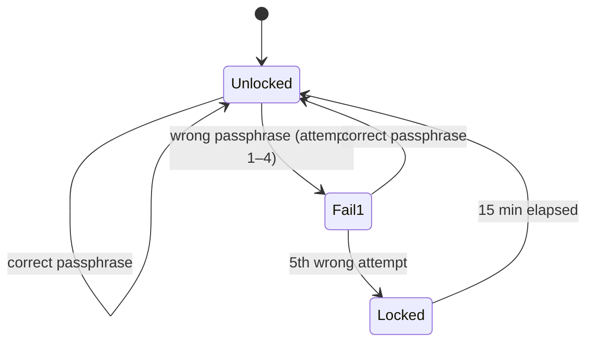
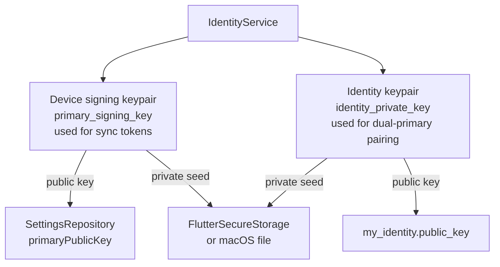

# Backup, Identity & Fiscal Year — As Built

> Source-of-truth document generated from code inspection on 2026-03-27.  
> Files: `backup_service.dart` (259 L), `encrypted_backup_service.dart` (422 L), `identity_service.dart` (266 L), `fiscal_year_service.dart` (269 L)

---

## 1. Overview



---

## 2. BackupService

Simple, no-encryption backup for quick device-to-device transfer or local retention.

### 2.1 Export Format

| Property | Value |
|---|---|
| Format | Raw SQLite `.db` file (binary copy) |
| Compression | None |
| Encryption | None |
| Location | `getApplicationDocumentsDirectory()/backups/` |
| Filename | `kash_cube_backup_<ISO8601-timestamp>.db` (colons → dashes) |
| Scope | Entire live `kash_cube.db` — all 56 tables |

### 2.2 Restore Flow



No migration, no validation — byte-for-byte file replacement. App restart required.

### 2.3 Identity Section (added v62+)

Identity can be exported/imported separately from the DB file:

```dart
Future<Map<String, dynamic>?> exportIdentitySection()
// Returns: { 'schema': 1, 'identity_id', 'display_name', 'public_key',
//            'avatar_seed', 'created_at', 'private_key_seed' }

Future<void> importIdentitySection(Map<String, dynamic>? section)
// null → no-op (old backup → fresh identity generated)
// non-null → writes seed to IdentityService, then updates my_identity table
```

JSON-string wrappers: `exportIdentityJson()` / `importIdentityJson()`.

### 2.4 BackupInfo Model

| Field | Type |
|---|---|
| `path` | String |
| `name` | String |
| `size` | int (bytes) |
| `createdAt` | DateTime |
| `formattedSize` | String (computed: B/KB/MB) |

---

## 3. EncryptedBackupService

Password-protected backup for long-term storage and cross-device restore.

### 3.1 File Format (`.kashcube` binary layout)

```
Offset   Size   Field
──────   ────   ─────────────────────────────────────────────────
0        4      Magic bytes: 'KSHC' (ASCII)
4        1      Format version: 1
5        16     PBKDF2 salt (cryptographically random per backup)
21       12     AES-GCM IV / nonce (cryptographically random)
33       4      DB schema version (big-endian uint32, unencrypted)
37       N      AES-256-GCM ciphertext + 16-byte GCM auth tag
```

**Encrypted payload (plaintext before AES-GCM encryption):**
```
Offset   Size   Field
──────   ────   ─────────────────────────────
0        4      Manifest JSON byte length (big-endian uint32)
4        M      Manifest JSON (UTF-8)
4+M      R      Raw kash_cube.db bytes
```

**Manifest JSON fields:** `created_at`, `app_version`, `schema_version` (int), `databases` (array of DB filenames).

### 3.2 Cryptography

| Property | Value |
|---|---|
| Symmetric cipher | AES-256-GCM (via `encrypt` package) |
| GCM auth tag | 16 bytes, appended to ciphertext by library |
| Key derivation | PBKDF2-HMAC-SHA256 |
| PBKDF2 iterations | 100 000 |
| PBKDF2 salt | 16 bytes, random per export |
| Key length | 32 bytes (256-bit) |
| Key derivation thread | Flutter `compute()` isolate (off UI thread) |

Password is never stored — only used transiently in memory. `ArgumentError` if empty passphrase.

### 3.3 Auth Failure Lockout



After 5 failed attempts → **15-minute lockout** stored in `SharedPreferences` (`enc_backup_locked_until` as ISO string). Attempts counter resets to 0 on lockout.

Public API: `isLockedOut()`, `lockoutMinutesRemaining()`, `attemptsRemaining()`

### 3.4 Pre-restore Snapshot

Before overwriting the live DB, `importEncrypted` saves current DB as:  
`<dbPath>/kash_cube_before_restore.db`

### 3.5 Output Location

`getApplicationDocumentsDirectory()/exports/kash_cube_<timestamp>.kashcube`

### 3.6 Auto-backup Settings

| SharedPreferences key | Values |
|---|---|
| `enc_backup_attempts` | int |
| `enc_backup_locked_until` | ISO8601 string |
| `last_backup_date` | ISO8601 string |
| `auto_backup_enabled` | bool string |
| `auto_backup_interval` | `'daily'` / `'weekly'` (default) / `'monthly'` |

---

## 4. IdentityService

Manages two Ed25519 keypairs and one DB identity row per installation.

### 4.1 Two Keypairs



| Keypair | Storage key | Public key stored | Algorithm |
|---|---|---|---|
| Device signing | `primary_signing_key` | `SettingsKeys.primaryPublicKey` | Ed25519 |
| Identity | `identity_private_key` | `my_identity.public_key` (SQLite) | Ed25519 |

Key material: 32-byte seeds, stored as base64 strings.

### 4.2 Initialization Sequence

**`ensureInitialized(SettingsRepository settings)` — called at app boot:**
1. Load or generate UUID v4 `deviceId` → `SettingsKeys.deviceId`
2. Load or set `deviceName` → `SettingsKeys.deviceName` (`Platform.localHostname` on native, `'KashCube Web'` on web)
3. Load device signing keypair seed from secure storage; if absent → generate new Ed25519 keypair, write seed
4. Extract + persist public key to `SettingsKeys.primaryPublicKey`

**`ensureIdentityInitialized(Database db)` — called after DB ready:**
1. Load identity keypair seed; if absent → generate new, write seed
2. Query `my_identity` table: if empty → INSERT new row with UUID v4 `identity_id`, `display_name`, public key
3. If row exists → load `identity_id`; if `public_key` differs → UPDATE (key rotation / restore scenario)

### 4.3 macOS Storage Exception

On macOS: `FlutterSecureStorage` is **not used**. Keys are written to plain files at:  
`~/Library/Containers/<bundle>/Data/Library/Application Support/.keys/<key_name>`

Reason: keychain requires developer certificate in sandbox mode. Controlled by `_useMacOsFileStorage` getter (`!kIsWeb && Platform.isMacOS`).

### 4.4 `my_identity` Table Row

Always `id = 1` — single-row table:

| Column | Value |
|---|---|
| `id` | `1` |
| `identity_id` | UUID v4 string |
| `display_name` | String (set on first creation only) |
| `public_key` | Base64 Ed25519 public key (32 bytes) |
| `updated_at` | ISO8601 (set on key rotation only) |

### 4.5 QR Payload

```json
{ "identity_id": "<uuid>", "identity_public_key": "<base64>" }
```

Used in dual-primary device pairing flow (Phase D1).

### 4.6 Cryptographic Operations

```dart
Future<Signature> sign(List<int> message)              // uses device keypair
Future<Signature> signWithIdentity(List<int> message)  // uses identity keypair
Future<bool> verify({message, sigBase64, publicKeyBase64})
```

All use the `cryptography` package (`Ed25519()` class).

---

## 5. FiscalYearService

Handles Indian financial year (Apr–Mar) date arithmetic and delegates number generation to `NumberReservationService`.

### 5.1 FY Date Calculation

```
fiscal_year_start_month = 4 (April, default)
fiscal_year_start_day   = 1 (1st, default)

thisYearStart = DateTime(date.year, startMonth, startDay)

if date >= thisYearStart:
    FY = date.year → date.year + 1   (e.g. Apr 2025 → Mar 2026)
else:
    FY = date.year - 1 → date.year   (e.g. Jan 2026 → still FY 2025–26)

end = nextFYStart - 1 day
```

### 5.2 FY Label Format

| Condition | Label format | Example |
|---|---|---|
| `startMonth == 1` | `CY {YYYY}` | `CY 2025` |
| otherwise | `FY {YYYY}–{YY}` | `FY 2025–26` |

### 5.3 Number Format Tokens

Format strings stored in `settings` table; tokens expanded by `_applyTokens`:

| Token | Meaning | Example |
|---|---|---|
| `{YYYY}` | 4-digit FY start year | `2025` |
| `{YY}` | 2-digit FY start year | `25` |
| `{YY+1}` | 2-digit FY end year | `26` |
| `{SEQ}` | 4-digit zero-padded sequence | `0042` |

Token replacement order: `{YY+1}` before `{YY}` (avoids partial match).

### 5.4 Default Number Formats

| Document type | Default format | Example output |
|---|---|---|
| Invoice | `INV-{YY}-{YY+1}-{SEQ}` | `INV-25-26-0042` |
| Quote | `QT-{YY}-{YY+1}-{SEQ}` | `QT-25-26-0001` |
| Delivery Challan | `DC-{YY}-{YY+1}-{SEQ}` | `DC-25-26-0001` |
| Credit Note | `CN-{YY}-{YY+1}-{SEQ}` | `CN-25-26-0001` (hardcoded, not from settings) |
| Debit Note | `DN-{YY}-{YY+1}-{SEQ}` | `DN-25-26-0001` (hardcoded, not from settings) |

### 5.5 FY Rollover Detection

```dart
Future<void> ensureCurrentFYStart()   // called at app startup
Future<bool> isResetDue()             // true if actual FY start > stored value
Future<bool> isApproachingYearEnd({int daysBeforeEnd = 30})
```

`ensureCurrentFYStart` updates `current_fy_start` in settings when FY changes. **No automatic sequence reset** — signals that reset is due; action left to caller (year-end wizard).

`last_fy_close_date` is referenced in comments as set by a year-end closing wizard — **not written by `FiscalYearService` itself**.

### 5.6 Settings Keys Consumed

| Key | Default | Purpose |
|---|---|---|
| `fiscal_year_start_month` | `'4'` | April (Indian FY) |
| `fiscal_year_start_day` | `'1'` | 1st of month |
| `invoice_no_format` | `'INV-{YY}-{YY+1}-{SEQ}'` | User-customizable |
| `quote_no_format` | `'QT-{YY}-{YY+1}-{SEQ}'` | User-customizable |
| `challan_no_format` | `'DC-{YY}-{YY+1}-{SEQ}'` | User-customizable |
| `auto_reset_invoice_no` | `'1'` | Reset counters each FY |
| `current_fy_start` | (written by service) | FY change detection |
| `last_fy_close_date` | (written by wizard) | Unused by FYS directly |

---

## 6. Backup Comparison

| Feature | `BackupService` | `EncryptedBackupService` |
|---|---|---|
| Format | Raw `.db` | Binary `.kashcube` |
| Encryption | None | AES-256-GCM |
| Key derivation | — | PBKDF2-HMAC-SHA256 (100k iter) |
| Includes identity | Optional (separate export) | Embedded in ciphertext |
| Auth failure protection | None | 5 attempts → 15 min lockout |
| Pre-restore snapshot | No | Yes (`kash_cube_before_restore.db`) |
| File size | Same as DB | DB + manifest overhead + AES tag |
| Use case | Quick local backup / dev | Long-term secure archive |
