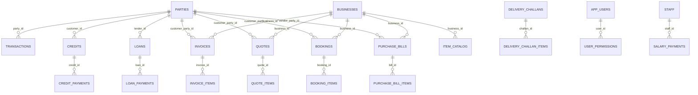

# Database Schema (As-Built, Detailed)

Primary source: `lib/data/services/database_helper_tables.dart`  
Scope: fresh-install schema created by `_DatabaseTableCreators` extension.

## 1) Table Count

**61 tables** are defined in the current schema.

## 2) Global Conventions

### 2.1 Sync/Audit columns pattern

Many operational tables include:

- `sync_id TEXT UNIQUE DEFAULT (lower(hex(randomblob(16))))`
- `version INTEGER NOT NULL DEFAULT 0`
- `created_by_device_id TEXT`
- `updated_by_device_id TEXT`
- `created_at TEXT`
- `updated_at TEXT`
- `deleted_at TEXT`

### 2.2 Session scoping pattern

Business-context scoped tables often include:

- `context_id INTEGER REFERENCES linked_business_sessions(id) ON DELETE CASCADE`
- dedicated index on `context_id`

### 2.3 Auto-updated timestamps

`AFTER UPDATE` trigger `trg_<table>_sync_updated` exists for these tables:

- `transactions`, `credits`, `credit_payments`, `loans`, `parties`, `accounts`, `categories`, `budgets`, `item_catalog`, `scheduled_payments`, `businesses`, `invoices`, `purchase_bills`

This trigger sets `updated_at = datetime('now')` if caller didn’t mutate `updated_at`.

### 2.4 Unique sync indexes

`idx_<table>_sync_id` exists for the same p0 set above to guarantee cross-device row identity.

---

## 3) Domain Catalog (Detailed)

### A) Core Finance Ledger

| Table | Primary keys / unique | Key columns | Foreign keys | Notable indexes |
|---|---|---|---|---|
| `transactions` | `id` PK, `dedupe_hash` UNIQUE, `sync_id` UNIQUE | amount, date, type, mode, category, payment_method, party/account links, invoice/booking links, reminder fields | `party_id -> parties.id`, `account_id -> accounts.id`, self refs on `linked_transaction_id` & `parent_transaction_id`, `context_id -> linked_business_sessions.id` | date, party, `(mode,type,date)`, category, account/to_account, auto_detected/verified, deleted, reminder, linked, invoice, booking, business, context |
| `credits` | `id` PK, `sync_id` UNIQUE | customer_name, total/paid/pending, direction, due/cleared dates, overdue flags, interest fields | `customer_id -> parties.id`, `business_id -> businesses.id`, `context_id -> linked_business_sessions.id` | customer, status `(is_cleared,is_overdue)`, due_date, pending desc, direction, context |
| `credit_payments` | `id` PK, `sync_id` UNIQUE | credit_id, amount, payment_date, payment_method, linked transaction | `credit_id -> credits.id` (CASCADE), `transaction_id -> transactions.id`, `context_id -> linked_business_sessions.id` | credit_id, payment_date desc, context |
| `loans` | `id` PK, `sync_id` UNIQUE | direction, lender_name, principal/paid/pending, EMI fields, due/next EMI, interest fields | `lender_id -> parties.id`, `business_id -> businesses.id`, `context_id -> linked_business_sessions.id` | lender, status, next_emi_date, direction, context |
| `loan_payments` | `id` PK, `sync_id` UNIQUE | installment_number, due_date, amount, paid_amount, is_paid, paid_date | `loan_id -> loans.id` (CASCADE) | loan_id, due_date, `(is_paid,due_date)` |
| `accounts` | `id` PK, `sync_id` UNIQUE | account_type, account_name, balances, credit_limit, linked_bank_account_id, flags (`is_active`,`is_primary`) | self ref `linked_bank_account_id -> accounts.id`, `context_id -> linked_business_sessions.id` | account_type, is_active, context |
| `categories` | `id` PK, `name` UNIQUE, `sync_id` UNIQUE | parent_category, category_type, mode, icon, color, system/active flags, keywords | `context_id -> linked_business_sessions.id` | context |
| `budgets` | `id` PK, `sync_id` UNIQUE, `UNIQUE(year,month,category)` | year, month, category, budget_amount, alert_at_percentage | `context_id -> linked_business_sessions.id` | context |
| `recurring_transactions` | `id` PK, `sync_id` UNIQUE | amount, type, category, party_name, frequency, next_date, last_generated, is_active | none explicit | none explicit |
| `scheduled_payments` | `id` PK, `sync_id` UNIQUE | type/category, one-time/frequency settings, next_date, auto flags, party/payment info, bill_context | `party_id -> parties.id`, `context_id -> linked_business_sessions.id` | active/deleted, next_date, auto_create+next_date, party, context |
| `bills` | `id` PK, `sync_id` UNIQUE | amount, category, frequency, due_day, auto-pay & active flags, payment_method, last_paid_date | none explicit | active+deleted, due_day |
| `bill_attachments` | `id` PK, `transaction_id` UNIQUE, `sync_id` UNIQUE | file_path/name/type/size | `transaction_id -> transactions.id` (CASCADE) | transaction_id |

### B) Parties and Communication

| Table | Primary keys / unique | Key columns | Foreign keys | Notable indexes |
|---|---|---|---|---|
| `parties` | `id` PK, `sync_id` UNIQUE | identity/contact (`name`,`phone`,`email`), classification (`party_type`,`party_context`), aggregate totals, GST/address/social/staff meta | `context_id -> linked_business_sessions.id` | name, phone, party_type, context |
| `party_addresses` | `id` PK, `sync_id` UNIQUE | label, address/city/state/pincode/country, gstin, is_default | `party_id -> parties.id` (CASCADE) | party_id, `(party_id,is_default)` |
| `party_reminders` | `id` PK, `sync_id` UNIQUE | party_name, channel, message, invoice refs/count, outstanding, sent_at | `business_id -> businesses.id` | party_name, sent_at desc, business_id |

### C) Business Docs and Revenue Flows

| Table | Primary keys / unique | Key columns | Foreign keys | Notable indexes |
|---|---|---|---|---|
| `businesses` | `id` PK, `sync_id` UNIQUE | legal/profile fields, GST, contact, logo, active flag, UPI/social fields | `context_id -> linked_business_sessions.id` | is_active, context |
| `quotes` | `id` PK, `quote_no` UNIQUE, `sync_id` UNIQUE | customer info, status, valid_until, subtotal/tax/discount/total, GST fields, freight/insurance/packing, `pending_number_since` | `context_id -> linked_business_sessions.id` | status, business_id |
| `quote_items` | `id` PK | item_name, qty, unit_price, tax_pct, discount_pct, line_total, hsn/unit | `quote_id -> quotes.id` (CASCADE) | none explicit |
| `invoices` | `id` PK, `invoice_no` UNIQUE, `sync_id` UNIQUE | quote/customer refs, status, issue/due dates, totals & paid amount, GST/IRN/EWB payload fields, transport meta, delivery address block, CN/DN original invoice refs, `pending_number_since` | `quote_id -> quotes.id` (SET NULL), `challan_id -> delivery_challans.id` (SET NULL), `context_id -> linked_business_sessions.id` | status, due_date, business_id, reminder+due, ewb_no, context |
| `invoice_items` | `id` PK | qty, unit_price, tax/discount, line_total, hsn, `catalog_item_id`, `lot_allocation_json` | `invoice_id -> invoices.id` (CASCADE) | none explicit |
| `bookings` | `id` PK, `sync_id` UNIQUE | customer/service refs, start/end/duration, status/type, total/advance/paid, notification/reminder fields, booking_ref | `customer_party_id -> parties.id`, `service_item_id -> item_catalog.id`, `invoice_id -> invoices.id`, `business_id -> businesses.id` | status, start_datetime, customer_party_id, business_id, booking_type, reminder+start |
| `booking_items` | `id` PK | item/service snapshot, qty/unit/rates/tax/discount/line_total, sac_code, sort_order | `booking_id -> bookings.id` (CASCADE), `service_item_id -> item_catalog.id` | booking_id |
| `delivery_challans` | `id` PK, `challan_no` UNIQUE, `sync_id` UNIQUE | customer info, status/date/purpose, subtotal, transport fields, ewb_no, delivery address block, converted invoice ref, `pending_number_since` | `customer_party_id -> parties.id`, `converted_invoice_id -> invoices.id` (SET NULL) | status, challan_date desc, customer_party_id, ewb_no |
| `delivery_challan_items` | `id` PK | item rows with qty/unit/price/line_total, hsn/sac, catalog ref | `challan_id -> delivery_challans.id` (CASCADE) | challan_id |
| `purchase_bills` | `id` PK, `sync_id` UNIQUE | vendor info, bill/due dates, place_of_supply, reverse_charge, subtotal + IGST/CGST/SGST/CESS totals, ITC fields, payment status, attachment | `vendor_party_id -> parties.id` (SET NULL), `context_id -> linked_business_sessions.id` | business_id, bill_date, status, reverse_charge, context |
| `purchase_bill_items` | `id` PK | qty/rate/tax/discount/line_total, tax amount columns, hsn/unit, lot/expiry/mfg | `bill_id -> purchase_bills.id` (CASCADE) | none explicit |
| `invoice_number_cursors` | `doc_type` PK | prefix, last_seq, updated_at | none | PK lookup only |
| `document_templates` | `id` PK, `sync_id` UNIQUE | based_on preset, accent color, header style, logo/decimal/page settings, advanced font/layout/column settings, active/preset flags | none | seeded presets; no explicit index |

### D) Catalog, Stock, and Units

| Table | Primary keys / unique | Key columns | Foreign keys | Notable indexes |
|---|---|---|---|---|
| `item_catalog` | `id` PK, `sync_id` UNIQUE | product/service master: unit_price, tax, HSN/SAC, SKU, category, favorites/usage, booking defaults, inventory controls (`track_inventory`,`stock_qty`,`low_stock_threshold`) | `context_id -> linked_business_sessions.id` | business_id, category, is_favorite, last_used_at, context |
| `unit_types` | `id` PK, `label` UNIQUE | code, label, system flag, sort_order | none | seeded values |
| `stock_movements` | `id` PK, `sync_id` UNIQUE | item movement ledger: movement_type, qty, stock_after, reference type/id | `item_id -> item_catalog.id` (CASCADE), `business_id -> businesses.id` | item_id, created_at desc, business_id |
| `item_stock` | composite PK `(business_id,item_id)` | stock_qty, low_stock_threshold, track flag, last_counted qty/time | `business_id -> businesses.id`, `item_id -> item_catalog.id` (CASCADE) | item_id |
| `stock_lots` | `id` PK, `sync_id` UNIQUE | FEFO lot inventory: lot_no, expiry/mfg, unit_cost, qty_in/remaining, status, notes | `business_id -> businesses.id`, `item_id -> item_catalog.id` (CASCADE), `purchase_bill_id -> purchase_bills.id` (SET NULL) | `(business_id,item_id)`, FEFO composite `(business_id,item_id,expiry_date,created_at,id)`, bill, remaining qty |
| `lot_movements` | `id` PK | lot-level movement trail: movement_type, qty, lot_qty_after, reference fields | `business_id -> businesses.id`, `item_id -> item_catalog.id` (CASCADE), `lot_id -> stock_lots.id` (CASCADE) | lot+created_at, reference_type+reference_id, business+item+created_at |
| `transporters` | `id` PK | name, gstin, last_used_at | none | name |
| `hsn_master` | `id` PK | code, description, type (`HSN` default) | none | code, type |

### E) Staff and Payroll

| Table | Primary keys / unique | Key columns | Foreign keys | Notable indexes |
|---|---|---|---|---|
| `staff` | `id` PK, `sync_id` UNIQUE | HR master: designation, contact, salary type/base, bank+tax ids, active flag | `business_id -> businesses.id`, `party_id -> parties.id` | is_active, business_id, party_id |
| `salary_payments` | `id` PK, `sync_id` UNIQUE | payroll period (month/year), salary components (allowances/deductions/bonus/net), paid_date/status | `staff_id -> staff.id` (CASCADE) | staff_id, `(pay_period_year,pay_period_month)` |
| `payroll_notifications` | `id` PK, `notification_id` UNIQUE | source identity, business name, amount/currency, paid_on, status, created transaction link | `created_transaction_id -> transactions.id` (SET NULL) | implicit PK/UNIQUE only |

### F) Settings, Auth, Permissions, Plans

| Table | Primary keys / unique | Key columns | Foreign keys | Notable indexes |
|---|---|---|---|---|
| `settings` | `key` PK | generic KV config + updated_at | none | PK lookup |
| `app_users` | `id` PK, `sync_id` UNIQUE | display_name, pin_hash, role, active/default device, last_login_at | `linked_party_id -> parties.id` (SET NULL) | is_active, linked_party_id |
| `user_permissions` | `id` PK, `UNIQUE(user_id,business_id,module)` | module CRUD flags by user/business | `user_id -> app_users.id` (CASCADE) | user_id |
| `subscription` | singleton style `id` PK default 1 | plan/source, purchase token, start/expiry, trial flags | none | seeded row id=1 |
| `plan_features` | composite PK `(plan,feature)` | enabled flag + limit_value | none | PK lookup |
| `activity_log` | `id` PK | entity_type, entity_id, type, message, meta, created_at | none | `(entity_type,entity_id,created_at DESC)` |

### G) Device Identity and Sync Infrastructure

| Table | Primary keys / unique | Key columns | Foreign keys | Notable indexes |
|---|---|---|---|---|
| `linked_devices` | `id` PK, `sync_id` UNIQUE, `device_id` UNIQUE | device profile, key material, user/party link, scope JSON, grace/preset, sync/revocation timestamps, secondary identity fields | `user_id -> app_users.id` (SET NULL), `linked_party_id -> parties.id` (SET NULL) | revoked_at, linked_party_id |
| `device_recovery` | `id` PK | recovery_key_hash, kdf_salt, rotation timestamps | none | PK lookup |
| `pairing_history` | `id` PK | device_id/name, permission_preset, paired_at | none | paired_at desc |
| `device_session` | singleton style `id` PK default 1 | active_user_id, active_business_id, locked, last_activity_at | `active_user_id -> app_users.id` | seeded row id=1 |
| `my_identity` | `id` PK, `identity_id` UNIQUE | display_name, avatar_seed, public_key, created/updated | none | identity_id unique |
| `linked_business_sessions` | `id` PK, `session_id` UNIQUE | primary identity/public key/device, business_ids JSON, token payload/signature, permission scope, grace days, unlink/read-only flags | none | session_id unique |
| `trusted_peers` | `id` PK, `peer_identity_id` UNIQUE | peer metadata, encrypted shared secret, paired/sync activity, is_active | none | is_active |
| `sync_outbox` | `id` PK | target device/identity, event_type, payload, created/delivered timestamps | none | partial pending index on `delivered_at IS NULL`, target_device_id |
| `sync_watermarks` | composite PK `(peer_identity_id,table_name)` | last_synced_at, last_sync_cursor | none | PK lookup |
| `sync_table_state` | composite PK `(peer_identity_id,table_name)` | sync_mode, last sync/version/pk cursor, schema_fingerprint, updated_at | none | table_name, updated_at |
| `invoice_events` | `id` PK, `sync_id` UNIQUE | invoice_id, event_type, event_data, occurred_at, device_id | none | `(invoice_id,occurred_at)` |

---

## 4) Topology Snapshot

---

## 5) Practical Engineering Notes

1. `invoice_number_cursors` is the atomic allocator backing conflict-free invoice/quote/DC numbering across linked devices.
2. `pending_number_since` appears in `quotes`, `invoices`, and `delivery_challans` for secondary-device deferred numbering.
3. FEFO inventory is fully represented by `stock_lots` + `lot_movements` + lot allocation JSON on `invoice_items`.
4. Sync progression is table-driven (`sync_table_state`, `sync_watermarks`) rather than hardcoded per business table.
5. `settings` is a critical control plane: FY boundaries, numbering formats, auth/session toggles, feature flags, and plan behavior all depend on it.
