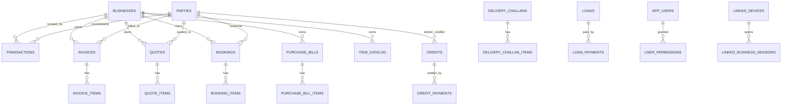

# Database Schema (As-Built)

Primary source: `lib/data/services/database_helper_tables.dart`

## 1) Table Count

**56 tables** are currently defined.

## 2) Domain Grouping

### A. Core Finance Ledger
- `transactions`
- `credits`
- `credit_payments`
- `loans`
- `loan_payments`
- `accounts`
- `categories`
- `budgets`
- `recurring_transactions`
- `scheduled_payments`
- `bills`
- `bill_attachments`

### B. Parties and Communication
- `parties`
- `party_addresses`
- `party_reminders`

### C. Business Docs and Revenue Flows
- `businesses`
- `quotes`
- `quote_items`
- `invoices`
- `invoice_items`
- `bookings`
- `booking_items`
- `delivery_challans`
- `delivery_challan_items`
- `purchase_bills`
- `purchase_bill_items`
- `invoice_number_cursors`
- `document_templates`

### D. Catalog, Stock, and Units
- `item_catalog`
- `unit_types`
- `stock_movements`
- `item_stock`
- `stock_lots`
- `lot_movements`
- `transporters`
- `hsn_master`

### E. Staff and Payroll
- `staff`
- `salary_payments`
- `payroll_notifications`

### F. Settings, Auth, Permissions, Plans
- `settings`
- `app_users`
- `user_permissions`
- `subscription`
- `plan_features`
- `activity_log`

### G. Device Identity and Sync Infrastructure
- `linked_devices`
- `device_recovery`
- `pairing_history`
- `device_session`
- `my_identity`
- `linked_business_sessions`
- `trusted_peers`
- `sync_outbox`
- `sync_watermarks`
- `sync_table_state`
- `invoice_events`

## 3) Schema Topology

## 4) Sync/Trace Columns Pattern

Many business-critical tables include:

- `sync_id` (cross-device identity)
- `version` (merge/version progression)
- `created_by_device_id`
- `updated_by_device_id`
- `created_at`
- `updated_at`
- `deleted_at` (soft delete)

This indicates the schema is designed for eventual-consistency sync and audit-safe merge behavior.

## 5) Practical Notes

1. `settings` is key-value configuration and heavily used by startup/auth/theme/feature flags.
2. `invoice_events` is append-style event/audit support for invoice lifecycle synchronization.
3. `sync_table_state` and `sync_watermarks` show generic table-driven sync progression, not hardcoded per-table state.
4. Identity/session tables (`my_identity`, `linked_business_sessions`) enable session context switching beyond single-device assumptions.
