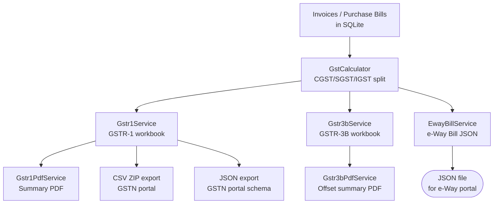
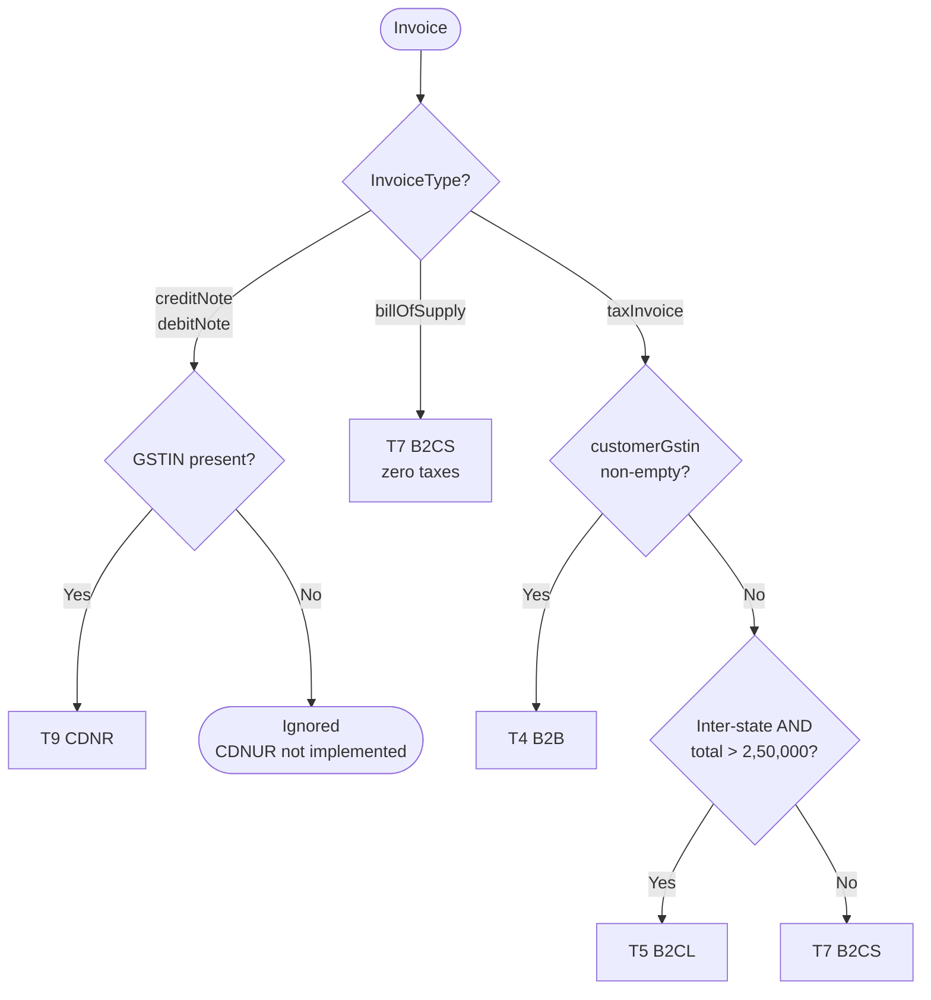
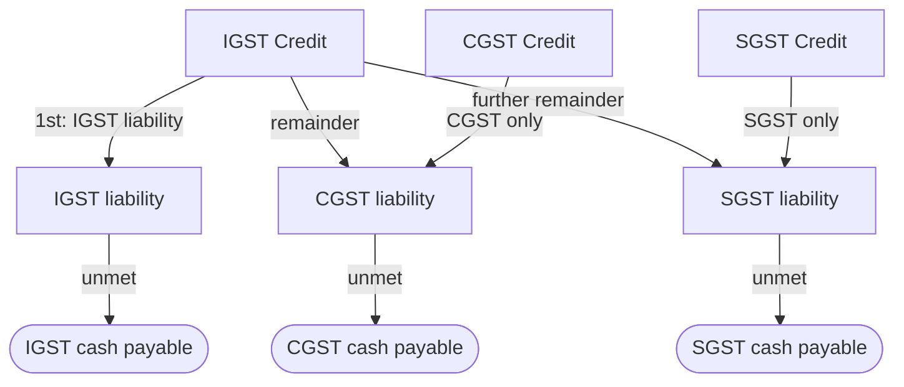
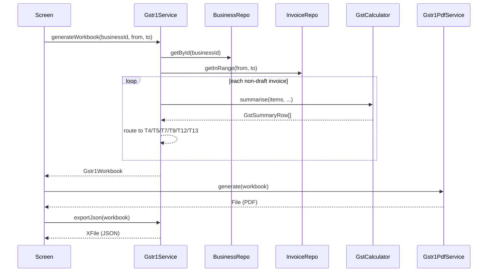

# GST Pipeline — As Built

> Source-of-truth document generated from code inspection on 2026-03-27.  
> Files: `gst_calculator.dart` (332 L), `gstr1_service.dart` (1 270 L), `gstr3b_service.dart` (378 L), `gstr1_pdf_service.dart` (437 L), `gstr3b_pdf_service.dart` (238 L), `eway_bill_service.dart` (720 L)

---

## 1. Pipeline Overview



---

## 2. GstCalculator

**Design:** Private constructor, all methods `static`. Zero state. No imports — pure Dart arithmetic.

### 2.1 CGST / SGST / IGST Split Logic

```dart
static GstSplit calculate({
  required String? sellerState,
  required String? buyerState,
  required double taxableAmount,
  required double gstPct,
})
```

**Inter-state detection:** Either state null/empty → inter-state. Otherwise: normalize both → compare.

```
IGST  = round2(taxableAmount * gstPct / 100)
CGST  = round2(igstTotal / 2)
SGST  = round2(igstTotal - cgstTotal)   ← anti-drift formula
```

`round2(v) = (v * 100).roundToDouble() / 100`

### 2.2 State Normalization

50-entry `_stateNormalMap`. Aliases handled:

| Alias | Normalizes to |
|---|---|
| `orissa` | `odisha` |
| `pondicheery` | `puducherry` |
| `up` | `uttar pradesh` |
| `uttaranchal` | `uttarakhand` |

Lookup: `trim().toLowerCase()` first; unknown strings pass through for exact comparison.

### 2.3 GSTR-1 HSN Summary (`summarise`)

Groups items by composite key `'${hsnOrSac}|${code}|${gstPct}'`:
- Taxable per item: `round2(qty × unitPrice × (1 - discountPct/100))`
- Skips items with `gstPct <= 0`
- Output sorted by `code` ascending

**`GstSummaryRow` fields:** `hsnOrSac`, `code`, `taxableAmount`, `gstPct`, `cgst`, `sgst`, `igst`, `total`, `isInterState`  
**Computed:** `codeLabel` → `"998314 (SAC)"` or `"— (SAC)"`

---

## 3. GSTR-1 Service

`Gstr1Service` — singleton, `gstr1ServiceProvider` Riverpod provider.

### 3.1 GSTR-1 Tables Handled

| Table | Section | Description | Routing condition |
|---|---|---|---|
| T4 | B2B | Taxable supply to registered buyers | `taxInvoice` + `customerGstin` non-empty |
| T5 | B2CL | Inter-state B2C > ₹2,50,000 | `taxInvoice` + no GSTIN + inter-state + `total > 250000` |
| T7 | B2CS | All other B2C | `taxInvoice` + no GSTIN (all else); also `billOfSupply` with zero taxes |
| T9 | CDNR | Credit/Debit note to registered receiver | `creditNote`/`debitNote` + GSTIN present |
| T12 | HSN | HSN/SAC quantity + value + tax summary | All non-draft, non-cancelled items |
| T13 | DOC_ISSUE | Invoice/CN/DN series summary | Invoice count + cancelled count |

**Not implemented:** CDNUR (unregistered C/D notes), imports, nil-rated exemption section.  
**Drafts excluded** from all tables. **Cancelled invoices** counted in T13 `cancelled` field but excluded from tax totals.

### 3.2 Invoice Routing Flowchart



### 3.3 State-code vs State-name Difference

`Gstr1Service` compares **2-char state codes** (first 2 chars of GSTIN via `GstinValidator.stateCodeFrom()`) against `inv.placeOfSupply` (stored as a 2-digit state code string like `"29"`).  
`GstCalculator` (used by `Gstr3bService`) compares **state names** and uses its own normalization map.  
These are two separate inter-state detection paths — both produce the same Boolean result for well-formed data.

### 3.4 GSTR-1 Export Formats

**CSV ZIP (`exportCsvZip`):**  
6 separate CSV files bundled by `CsvExporter.zipFiles()`:

| Table file | Columns |
|---|---|
| `T4_B2B` | GSTIN, Invoice No, Date, Value, POS, Reverse Charge, Rate, Taxable, IGST, CGST, SGST, CESS |
| `T5_B2CLarge` | State/POS, Rate, Taxable, IGST, CESS |
| `T7_B2CSmall` | Supply Type, State/POS, Rate, Taxable, IGST, CGST, SGST, CESS |
| `T9_CDN` | Counterparty GSTIN, NoteType, Note No, Date, Value, Rate, Taxable, IGST, CGST, SGST |
| `T12_HSN` | HSN/SAC, Description, UQC, Quantity, Total Value, Taxable, IGST, CGST, SGST, CESS |
| `T13_DocSummary` | Type, From, To, Total No., Cancelled, Net Issued |

File naming: `GSTR1_{period}_{gstin}_{table}.csv`  
Date format in CSV: `DD/MM/YYYY`

**JSON (`exportJson`) — GSTN portal schema:**  
Top-level keys: `gstin`, `fp` (period as `MMYYYY`), `b2b`, `b2cl`, `b2cs`, `cdnr`, `hsn`, `doc_issue`  

B2B structure (nested):
```json
[{ "ctin": "...", "inv": [{ "inum": "INV-25-26-0001", "idt": "01/04/2025",
   "val": 11800.0, "pos": "29", "rchrg": "N", "inv_typ": "R",
   "itms": [{ "num": 1, "itm_det": { "rt": 18, "txval": 10000.0,
              "iamt": 1800.0, "camt": 0.0, "samt": 0.0, "csamt": 0.0 }}]
}]}]
```

`returnPeriodLabel` format: `"MMYYYY"` e.g. `"032026"`.

**UQC map** (`_uqcMap`): 60-entry map of app unit strings → GSTN UQC codes  
(NOS, KGS, MTR, LTR, BOX, BAG, DOZ, SET, SQM, TON, HRS, DAY, MON, YRS, OTH…).  
Fallback: `'OTH'`.

---

## 4. GSTR-3B Service

`Gstr3bService` — singleton, `gstr3bServiceProvider` Riverpod provider.

### 4.1 GSTR-3B Sections Computed

| Section | Table | Source | Notes |
|---|---|---|---|
| Regular Outward Supply | 3.1 | Invoices (non-draft, non-cancelled, not CN/DN) | Auto-computed |
| Zero-rated / Exports | 3.1 | — | `Gstr3bTaxAmounts.zero` — manual entry required |
| Nil-rated / Exempt | 3.1 | — | `Gstr3bTaxAmounts.zero` — manual entry required |
| RCM Liability | 3.1(d) | Purchase bills where `reverseCharge == true` | `bill.subtotal` as taxable |
| Eligible ITC | 4 | Purchase bills where `itcEligibility == eligible` | Uses pre-computed bill amounts |
| Blocked ITC | 4 | Purchase bills where `itcEligibility == blocked` | Uses pre-computed bill amounts |
| Reversed ITC | 4 | — | Passed by caller (Rules 42/43, manual) |
| Interest / Late Fee | 5 | — | Passed by caller (manual) |

### 4.2 ITC Offset — Rule 88A Cascade



`netItc` per head: `max(0, itcEligible.x - itcReversed.x)` — clamped, no negatives.

`OffsetResult` fields: `igstByCredit`, `igstByCash`, `cgstByCredit`, `cgstByCash`, `sgstByCredit`, `sgstByCash`, `igstCreditBalance`, `cgstCreditBalance`, `sgstCreditBalance`.  
Computed: `totalCash`, `totalCredit`.

### 4.3 Outward Supply Calculation

Per invoice item:  
`taxable = round2(qty × unitPrice × (1 - discountPct/100))`  
Then: `GstCalculator.calculate(sellerState: business.state, buyerState: inv.placeOfSupply, taxableAmount: taxable, gstPct: item.taxPct)`

Note: `inv.placeOfSupply` is used as the `buyerState` string — `GstCalculator` normalizes it as a state name. For well-formed `placeOfSupply` values this produces correct results; ambiguous 2-digit codes are passed through as-is.

---

## 5. E-Way Bill Service

`EwayBillService` — singleton.

### 5.1 Threshold

```dart
bool isBelowThreshold(Invoice invoice)  // invoice.total < 50000
```

**₹50,000 threshold** from CGST Rule 138. Exposing this as a separate method lets the UI warn without blocking export.

### 5.2 JSON Payload Structure (GSTN EWB_Import_Template)

For Invoice:
```json
{
  "supplyType": "O",
  "subSupplyType": "1",
  "docType": "INV",
  "docNo": "INV-25-26-0001",
  "docDate": "24/02/2026",
  "fromGstin": "29AABCK...",
  "toGstin": "29AABCJ...",
  "totalValue": 10000.00,
  "cgstValue": 0, "sgstValue": 0, "igstValue": 1800.00,
  "totInvValue": 11800.00,
  "transMode": "1", "vehicleNo": "KA01AB1234",
  "itemList": [{
    "hsnCode": "998314",
    "quantity": 2.0, "qtyUnit": "NOS",
    "cgstRate": 0.0, "igstRate": 18.0,
    "taxableAmount": 10000.00
  }]
}
```

For Delivery Challan:
- `docType: 'CHL'`, `subSupplyType: '4'`
- All tax rates and amounts → `0.0`

### 5.3 Doc Type Codes

| `InvoiceType` | EWB `docType` |
|---|---|
| `taxInvoice` | `INV` |
| `billOfSupply` | `BIL` |
| `creditNote` | `CRN` |
| `debitNote` | `DBN` |

### 5.4 State Code Resolution (`_stateCodeInt`)

1. First 2 chars of GSTIN parsed as `int`
2. Fallback: `_stateCodeByName` — 37-entry map (lowercase name substring → `int` code 01–38)

Notable mappings in fallback:
- `'andhra': 28` (undivided AP code)
- `'uttaranchal': 5` (old Uttarakhand name)
- `'telangana': 36`
- `'ladakh': 38`

### 5.5 Taxable Amount Calculation in EWB

Back-calculation from line total:
```
_taxableAmount(item) = round2(lineTotal / (1 + taxPct/100))   if taxPct > 0
                     = round2(lineTotal)                        if taxPct == 0
```

This differs from GSTR-1/GSTR-3B which do forward calculation: `qty × unitPrice × (1 - discountPct/100)`.

### 5.6 Output Files

| Document | Saved at |
|---|---|
| Invoice EWB | `{tmp}/eway/EWB_{sanitizedInvoiceNo}.json` |
| Challan EWB | `{tmp}/eway/EWB_DC_{sanitizedChallanNo}.json` |

Characters `[ / \ : * ? " < > | ]` stripped from filenames.  
JSON: pretty-printed with `JsonEncoder.withIndent('  ')`.  
Shared via `share_plus` with MIME type `application/json`.

---

## 6. GSTR-1 PDF Service

**Output:** Single A4 summary page — not a full GSTR-1 replica.

### Layout sections

1. Header block (deep green bg): business name, GSTIN, "GSTR-1 WORKBOOK SUMMARY", period, generation date
2. **Table-wise summary** — 6 columns: `Table / Description | Invoices | Taxable Value | CGST | SGST | IGST`; rows for T4, T5, T7, T9, T12 (HSN count), T13 (doc count + ❌ cancelled)
3. **Tax liability summary** band — 5 blocks: Taxable Value | CGST | SGST | IGST | TOTAL TAX
4. **HSN/SAC summary table** — 7 columns; only shown if `tableHsn.isNotEmpty`
5. Footer

**Output filename:** `GSTR1_{returnPeriodLabel}_{gstin}_Summary.pdf` in `getTemporaryDirectory()`.  
**Amount format:** `NumberFormat('#,##,##0.00', 'en_IN')` (Indian numbering, 2dp).  
**Period label helper:** `_periodLabel("032026")` → `"March 2026"`.

---

## 7. GSTR-3B PDF Service

**Output:** Single A4 offset summary page.

### Layout sections

1. Header block: "GSTR-3B CONSOLIDATED OFFSET SUMMARY", business, GSTIN, period, date range
2. **TABLE 1 — Outward Supply Liability:** Regular Supply, Zero-rated/Exports (`—` for CGST/SGST), Nil-rated (`—` for IGST), TOTAL LIABILITY, Offset by ITC, Balance by Cash
3. **TABLE 2 — RCM Inward:** RCM Registered, Imports (hardcoded zeros), Interest/Late Fees, TOTAL RCM
4. **TABLE 3 — ITC Summary:** Eligible, Reversed (Rules 42/43), Blocked (Sec. 17(5)), NET ITC, Carry-forward rows per head
5. **TOTAL CASH REQUIRED** banner — dark red amount, `0xFFE8F5E9` bg
6. Footer disclaimer mentioning Rule 88A offset order

**Output filename:** `GSTR3B_Offset_{period}_{gstin}.pdf` in `getTemporaryDirectory()`.

---

## 8. Overall Data Flow



---

## 9. Key Constraints and Gaps

| Item | Detail |
|---|---|
| Zero-rated / Nil-rated outward | Not auto-computed in GSTR-3B — must be manually entered by user |
| CDNUR | Unregistered credit/debit notes not routed in GSTR-1 (table not implemented) |
| ITC from imports | Hardcoded as zero in GSTR-3B PDF |
| placeOfSupply type mismatch | GSTR-1 uses 2-char state code; GstCalculator uses state name — ensure `placeOfSupply` field matches what each service expects |
| Backward EWB calculation | EWB uses back-calculation from `lineTotal`; GSTR-1/3B use forward calculation — minor floating-point divergence possible |
