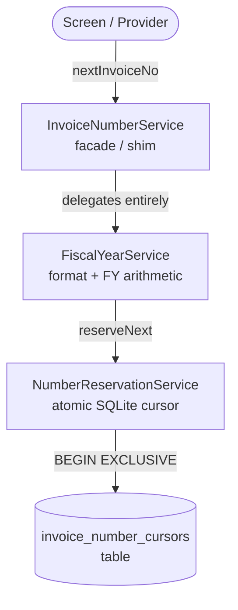
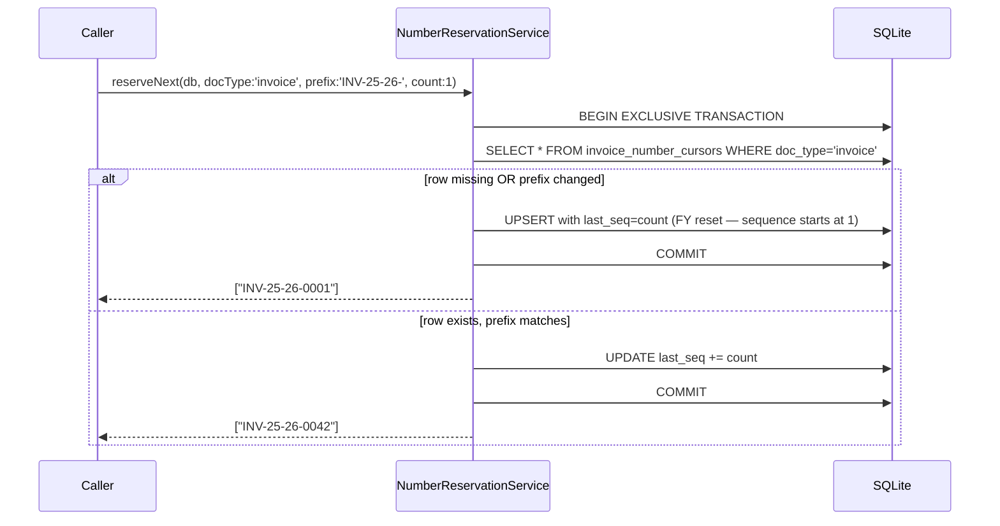
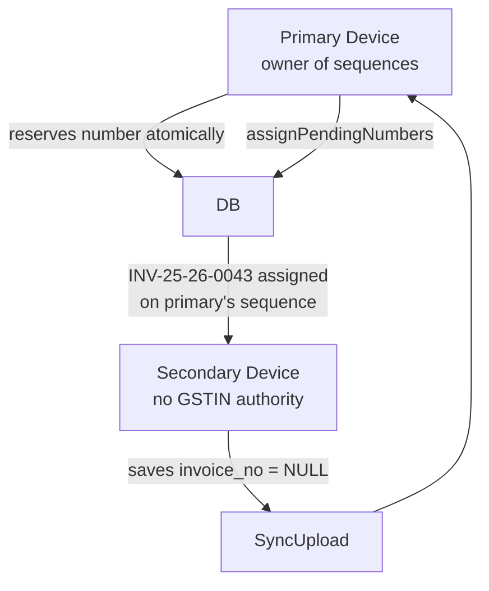
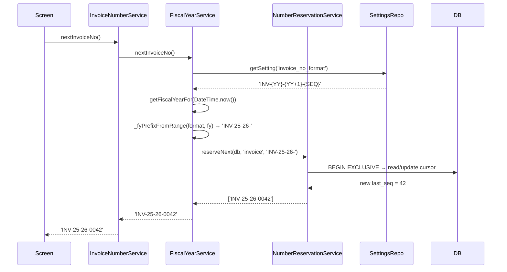

# Invoice Numbering — As Built

> Source-of-truth document generated from code inspection on 2026-03-27.  
> Files: `invoice_number_service.dart` (28 L), `number_reservation_service.dart` (218 L), `fiscal_year_service.dart` (see also BACKUP_IDENTITY_AS_BUILT.md)

---

## 1. Component Overview



### Component Roles

| Class | Role |
|---|---|
| `InvoiceNumberService` | Backward-compat façade; contains zero logic |
| `FiscalYearService` | Reads number format from settings; computes FY prefix; determines if FY rolled over |
| `NumberReservationService` | Atomic number assignment via SQLite exclusive transaction |

---

## 2. InvoiceNumberService

A 28-line façade that exists solely for backward compatibility — all real work is in `FiscalYearService`:

```dart
class InvoiceNumberService {
  static final instance = InvoiceNumberService._();
  InvoiceNumberService._();

  Future<String> nextInvoiceNo()     => FiscalYearService.instance.nextInvoiceNo();
  Future<String> nextQuoteNo()       => FiscalYearService.instance.nextQuoteNo();
  Future<String> nextCreditNoteNo()  => FiscalYearService.instance.nextCreditNoteNo();
  Future<String> nextDebitNoteNo()   => FiscalYearService.instance.nextDebitNoteNo();
}
```

Call-sites that already import `InvoiceNumberService` continue to work without changes.

---

## 3. FiscalYearService — Number Generation Path

For each document type, `FiscalYearService`:
1. Reads the format template from `settings` table (e.g. `'INV-{YY}-{YY+1}-{SEQ}'`)
2. Computes the current FY via `_getFiscalYearFor(DateTime.now())`
3. Calls `_fyPrefixFromRange(format, fy)` to extract everything before `{SEQ}` after token substitution (e.g. `"INV-25-26-"`)
4. Calls `NumberReservationService.instance.reserveNext(db, docType: 'invoice', prefix: prefix)`
5. Returns the formatted number string

### Format Tokens

| Token | Meaning | Example |
|---|---|---|
| `{YYYY}` | 4-digit FY start year | `2025` |
| `{YY}` | 2-digit FY start year | `25` |
| `{YY+1}` | 2-digit FY end year | `26` |
| `{SEQ}` | 4-digit zero-padded sequence | `0042` |

Substitution order: `{YY+1}` before `{YY}` to avoid partial match (`25` in `25-26`).

### Document Types and Formats

| Doc type | `docType` cursor key | Format setting | Default | Configurable? |
|---|---|---|---|---|
| Invoice | `'invoice'` | `invoice_no_format` | `INV-{YY}-{YY+1}-{SEQ}` | ✅ Yes |
| Quote | `'quote'` | `quote_no_format` | `QT-{YY}-{YY+1}-{SEQ}` | ✅ Yes |
| Delivery Challan | `'dc'` | `challan_no_format` | `DC-{YY}-{YY+1}-{SEQ}` | ✅ Yes |
| Credit Note | — | hardcoded | `CN-{YY}-{YY+1}-{SEQ}` | ❌ No |
| Debit Note | — | hardcoded | `DN-{YY}-{YY+1}-{SEQ}` | ❌ No |

---

## 4. NumberReservationService

### 4.1 DB Table: `invoice_number_cursors` (added DB v67)

| Column | Type | Description |
|---|---|---|
| `doc_type` | TEXT (PK) | `'invoice'`, `'quote'`, `'dc'`, `'credit_note'`, `'debit_note'` |
| `prefix` | TEXT | Full prefix up to `{SEQ}` (e.g. `'INV-25-26-'`) |
| `last_seq` | INTEGER | Last assigned sequence number |
| `updated_at` | TEXT | ISO8601 timestamp |

One row per doc type. The prefix change is the sole FY rollover trigger — no date comparison.

### 4.2 `reserveNext` — Atomic Acquisition



**Signature:**
```dart
Future<List<String>> reserveNext(
  Database db, {
  required String docType,
  required String prefix,
  int count = 1,       // bulk reservation: returns contiguous block
  int padWidth = 4,    // default 4-digit zero-padding
})
```

**Key invariants:**
- `BEGIN EXCLUSIVE` on SQLite connection — sufficient for all concurrent Dart isolate calls on the same connection (SQLite is single-writer in-process)
- Returns immediately committed numbers — no provisional/optimistic stage for the primary device
- Blank documents (with `invoice_no = NULL`) are never used on the primary

### 4.3 FY Rollover Detection

**Mechanism: prefix comparison only.**  
When the FY changes (e.g. April 1, 2026), the computed prefix changes from `'INV-25-26-'` to `'INV-26-27-'`. On the next call to `reserveNext`:
- Stored `prefix != currentPrefix` → triggers upsert with `last_seq = 1`
- Each FY starts fresh from `0001`
- No explicit date check — the prefix string is the FY boundary signal

### 4.4 Multi-Device Collision Prevention



Secondary devices save documents with:
- `invoice_no = NULL`
- `pending_number_since = <created_at timestamp>`

When the primary ingests a delta-upload (`assignPendingNumbers`):
1. Queries all `invoice_no IS NULL AND pending_number_since IS NOT NULL` rows, ordered by `created_at ASC`
2. For each row: determines the **correct FY** for that document's original creation date (not today's FY) via `FiscalYearService.getFiscalYearFor(row.createdAt)`
3. Calls `reserveNext` with that FY's prefix — preserves chronological sequence integrity
4. Updates `invoice_no = number, pending_number_since = null`

**Result:** Primary is the single source of truth for sequences. No conflicts, no optimistic locking needed.

### 4.5 Pending Number Tables

`assignPendingNumbers` processes these tables:

| Table | Column | `docType` key |
|---|---|---|
| `invoices` | `invoice_no` | `'invoice'` |
| `quotes` | `quote_no` | `'quote'` |
| `delivery_challans` | `challan_no` | `'dc'` |

---

## 5. Full Number Assignment Flow (Sequence Diagram)



---

## 6. User-Configurable Behaviour

| Setting | Where changed | Effect |
|---|---|---|
| `invoice_no_format` | Business Settings screen | Changes prefix pattern for the current + future FYs |
| `fiscal_year_start_month` | Business Settings screen | Changes when FY boundary occurs (counter reset trigger) |
| Custom starting number | ❌ Not supported | Sequences always reset to `0001` on FY rollover |
| `padWidth` | ❌ Not configurable | Hardcoded 4 digits; would require code change |

---

## 7. Key Design Decisions

| Decision | Rationale |
|---|---|
| Prefix-change as FY trigger | Avoids date comparison in `NumberReservationService`; format change also resets the counter (intentional — changing from `INV-` to `INVOICE-` starts fresh) |
| `BEGIN EXCLUSIVE` on SQLite | Correct for single-device; sufficient because SQLite is in-process single-writer |
| Secondary devices → pending_number | Preserves sequence authority on the primary without distributed locking; secondary UX shows "Pending" badge until sync |
| `InvoiceNumberService` façade | Backward compat; old call-sites don't need to change as numbering logic moved into `FiscalYearService` |
| Credit/Debit note formats hardcoded | Not user-customizable by design — regulatory documents should have predictable prefix patterns |
