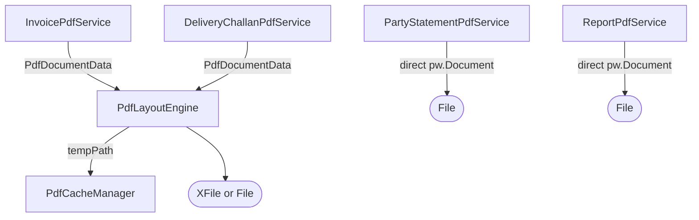
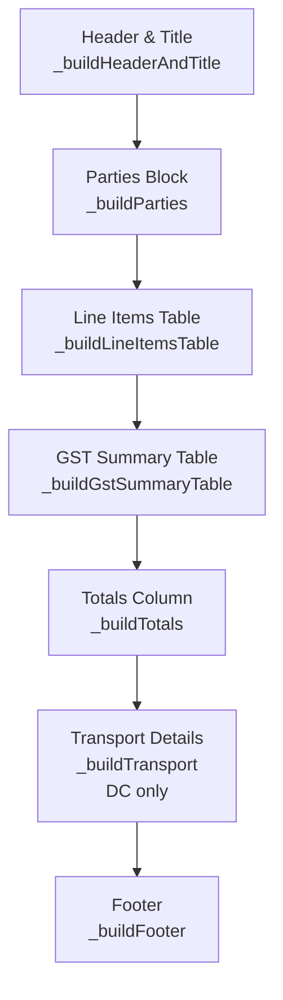
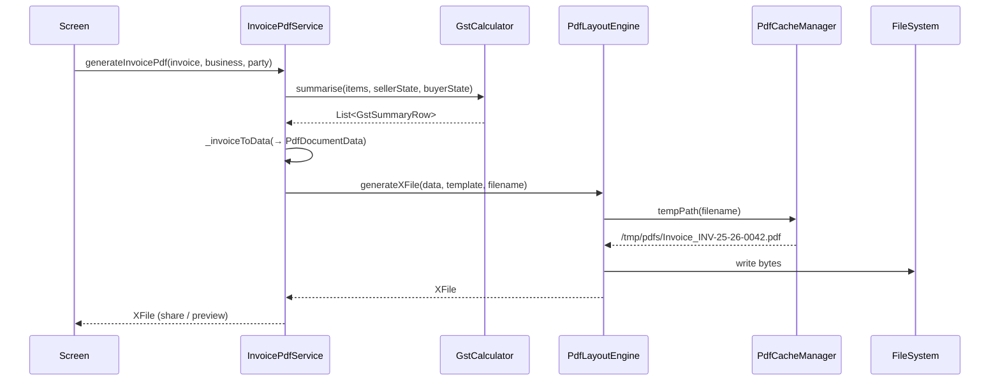

# PDF Pipeline — As Built

> Source-of-truth document generated from code inspection on 2026-03-27.  
> Files: `pdf_layout_engine.dart` (1 364 L), `invoice_pdf_service.dart` (413 L), `pdf_cache_manager.dart` (114 L), `party_statement_pdf_service.dart` (365 L), `delivery_challan_pdf_service.dart` (177 L), `report_pdf_service.dart` (323 L)

---

## 1. Architecture Overview



| Service | Uses Layout Engine? | Output type | Document kind |
|---|---|---|---|
| `InvoicePdfService` | Yes | `XFile` | Tax Invoice, Quote, Credit/Debit Note |
| `DeliveryChallanPdfService` | Yes | `XFile` | Delivery Challan |
| `PartyStatementPdfService` | **No** — direct `pw.Document` | `File` | Party statement ledger |
| `ReportPdfService` | **No** — direct `pw.Document` | `File` | P&L report |

---

## 2. PdfLayoutEngine

**Class:** `PdfLayoutEngine` — singleton (`PdfLayoutEngine.instance`).

### 2.1 Public API

```dart
Future<Uint8List> generateBytes(PdfDocumentData data, DocumentTemplate template)
Future<File>      generate(PdfDocumentData data, DocumentTemplate template, String filename)
Future<XFile>     generateXFile(PdfDocumentData data, DocumentTemplate template, String filename)
```

- `generateBytes` — pure in-memory; safe in isolates; used for thumbnails.
- `generate` — writes to `PdfCacheManager.instance.tempPath(filename)`.
- `generateXFile` — on web: in-memory `XFile.fromData`; on native: writes then wraps; MIME type `application/pdf`.

### 2.2 Document Templates

9 named presets; one is the active default:

| Preset name | Page size | Header style | Accent color | Notes |
|---|---|---|---|---|
| `classic` | A4 | Banner | Deep green | 2 decimal places |
| `modern` *(default)* | A4 | Minimal | Deep green | 0 decimal places |
| `plain` | A4 | Minimal | Black | No logo |
| `receipt` | 80mm thermal | Minimal | Black | No logo |
| `pharmacy` | A4 | Banner | Teal | — |
| `restaurant` | A4 | Banner | Brown | 0 decimal places |
| `service` | A4 | Minimal | Blue | — |
| `freelancer` | A4 | Minimal | Grey | No logo |
| `generic` | A4 | Minimal | Deep green | — |

**Page sizes:** `a4`, `a5`, `letter`, `thermal58mm` (58×200 mm), `thermal80mm` (80×200 mm).  
**Header styles:** `banner` (full-color header block) | `minimal` (text header + accent line).  
Active template: `DocumentTemplate.active` — mutable global default, changed via `DocumentTemplate.setActive()`.

### 2.3 Layout Sections (in render order)



**Thermal layout** (`_buildThermalContent`) is a separate single-column path: 8–10pt type, dashed text dividers, each item shown as `name` row + `qty × rate` row beneath.

### 2.4 Layout Engine Detail

**Line items table — conditional columns:**

| Column | Shown when |
|---|---|
| `#` | Always |
| `Item / Description` | Always |
| `HSN` | Any item has `hsnCode` |
| `Unit` | Any item has `unit` |
| `Qty` | Always |
| `Rate` | Always |
| `Tax %` | Not DC + any `taxPct > 0` |
| `Disc %` | Not DC + any `discountPct > 0` |
| `Amount` | Always |

**Parties block — layout by document type:**
- Delivery Challan → From / To boxes side-by-side
- Invoice/Quote without `shipTo` → Buyer left + meta box right
- Invoice/Quote with `shipTo` → BILL TO + SHIP TO left + meta box right

**Meta box (`_metaBox`):** 200px wide grey box — Place of Supply, Supply Type (IGST or CGST+SGST), Reverse Charge, Notes.

**Totals column:**
- DC: single "Total Value (Ex-tax)" row
- Invoice/Quote: Subtotal → GST split by rate band (`CGST@x%` / `SGST@x%` or `IGST@x%`) → Freight/Insurance/Packing if > 0 → **Total** (14–16pt bold) → optional Paid (green) + Balance Due (red)

**Free plan watermark:**  
`_buildFreeWatermarkBanner()` — amber banner: *"Created with KashCube Free · Remove watermark: upgrade to Starter at kashcube.app"*  
Shown when `showFreeWatermark == true`.

**UPI QR code:**  
URI: `upi://pay?pa=<upiId>&pn=<businessName>&am=<amount>&tn=<invoiceRef>&cu=INR`  
Rendered at 72×72pt via `QrPainter` (error correction `M`, square eye/data module shape).  
Shown when `showUpiQr == true && business.upiId?.isNotEmpty`.

### 2.5 Color Tokens (static PdfColor)

| Token | Hex | Used for |
|---|---|---|
| `_dark` | `#212121` | Body text |
| `_muted` | `#757575` | Descriptions, labels |
| `_divider` | `#E0E0E0` | Table borders, dividers |
| `_rowAlt` | `#F5F5F5` | Alternating table rows |
| Accent | from template | Header bg, table header bg |

**Number format:** `NumberFormat.currency(locale: 'en_IN', symbol: 'Rs.', decimalDigits: template.amountDecimalDigits)`

---

## 3. InvoicePdfService

**Class:** `InvoicePdfService` — singleton.

### Documents generated

| Method | Document type | File name pattern |
|---|---|---|
| `generateInvoicePdf` | Tax Invoice / Credit Note / Debit Note | `Invoice_<invoiceNo>.pdf` |
| `generateQuotePdf` | Quotation | `Quote_<quoteNo>.pdf` |

Both return `XFile` via `PdfLayoutEngine.instance.generateXFile(data, DocumentTemplate.active, filename)`.

### Status → Badge color

| Invoice status | Color |
|---|---|
| `paid` | green700 |
| `sent` | blue700 |
| `overdue` | red700 |
| `partiallyPaid` | orange700 |
| `draft` / `pendingNumber` | grey600 |
| `cancelled` | grey400 |

| Quote status | Color |
|---|---|
| `accepted` | green700 |
| `sent` | blue700 |
| `rejected` | red700 |
| `draft` / `pendingNumber` | grey600 |

### Special per-type labels

- Credit Note / Debit Note → `subTypeLabel = 'Against: <originalInvoiceNo>'`
- Quote → `subTypeLabel = 'For <invoiceType.label>'`

### Inter-state detection

If GST summary rows exist: `gstRows.first.isInterState`.  
Otherwise: `GstCalculator.isInterState(sellerState, buyerState)`.

---

## 4. DeliveryChallanPdfService

Thin adapter over `PdfLayoutEngine`. Differences from invoice:

- `PdfDocumentData.type = PdfDocumentType.deliveryChallan`
- No GST rows; `totals` = `PdfTotals(subtotal, grandTotal: subtotal)` — no freight fields
- No `reverseCharge`, no `dueDate`, no UPI QR
- Transport block populated when any of `vehicleNo`, `transporterName`, `distanceKm` present
- Output file: `DC_<challanNo with '/' replaced by '-'>.pdf`

**Status → color:** `dispatched`→blue700, `returned`→orange700, `converted`→green700, `draft`/`pendingNumber`→grey600

---

## 5. PartyStatementPdfService

Builds `pw.Document` directly — does **not** use `PdfLayoutEngine`.

### Statement row types

```dart
enum _TxType { invoice, creditGiven, creditReceived, loanLent, loanBorrowed }
```

| Source | Debit column | Credit column |
|---|---|---|
| Invoice (non-draft) | `invoice.total` | `invoice.paidAmount` if > 0 |
| Credit given | `credit.totalAmount` | — |
| Credit received | — | `credit.totalAmount` |
| Loan lent | `loan.principalAmount` | — |
| Loan borrowed | — | `loan.principalAmount` |

All rows sorted by date ascending. Running balance computed inline (`balance += debit - credit`).

### Layout

- `pw.MultiPage`, A4, 32pt margins
- Per-page header: party name, phone (+91), address, net badge (Receivable green / Payable red)
- 6-column table with `TableBorder.all(grey300, 0.5)`: Date | Ref | Description | Dr | Cr | Balance
- Paid rows: `0xFFF9FBE7` background + ✓ appended to description
- Totals row: shows `Dr` or `Cr` suffix on net balance

**Output filename:** `Statement_<safe_party_name>_<timestamp_ms>.pdf` saved to `getTemporaryDirectory()`.  
`safe_party_name = party.name.replaceAll(RegExp(r'[^\w]'), '_')`

---

## 6. ReportPdfService

Builds `pw.Document` directly — does **not** use `PdfLayoutEngine`.

### Input model: `MonthlyPnL`

| Field | Type |
|---|---|
| `totalIncome` | `double` |
| `totalExpense` | `double` |
| `netProfitLoss` | `double` |
| `incomeByCat` | `Map<String, double>` |
| `expenseByCat` | `Map<String, double>` |
| `topParties` | `List<PartyTotal>` |

### Layout

- `pw.MultiPage`, A4, `horizontal: 36, vertical: 32`
- Header: "Profit & Loss Report" + period + accent badge
- Summary row: 3 cards — Total Income (green) | Total Expense (red) | Net Profit/Loss
- Income by Category table (sorted descending, % share column) — only if non-empty
- Expense by Category table — only if non-empty
- Top 5 parties table — only if non-empty

**Output filename:** `KashCube_PnL_<sanitized_period>.pdf` saved to `getTemporaryDirectory()`.

---

## 7. PdfCacheManager

**Class:** `PdfCacheManager` — singleton.

### Cache directory

`<getTemporaryDirectory()>/pdfs/`

### Eviction policy

1. Delete any `.pdf` file with `modified` age ≥ **24 hours**
2. Sort remaining by `modified` ascending (oldest first)
3. While `count > 3` — delete from front

**Who calls `evict()`:** Caller's responsibility (app lifecycle `resumed`).  
**Who uses the cache:**  Only `PdfLayoutEngine.generate` and `PdfLayoutEngine.generateXFile`.  
`PartyStatementPdfService` and `ReportPdfService` call `getTemporaryDirectory()` directly — **not** subject to eviction.

### Cache key

Filename passed by caller. Convention:
- `Invoice_INV-25-26-0042.pdf`
- `Quote_Q-25-26-0001.pdf`
- `DC_DC-25-26-001.pdf`

### Other methods

| Method | Behavior |
|---|---|
| `clearAll()` | Deletes entire `/pdfs/` directory; called from Storage Health Dashboard |
| `totalSize()` | Sum of `.pdf` file sizes in bytes |

---

## 8. PDF Data Flow Diagram



---

## 9. Known Gaps

- `PdfDocumentType.booking` is declared in the enum but no service currently maps to it.
- `PartyStatementPdfService` and `ReportPdfService` bypass `PdfCacheManager` — their temp files are not evicted by the cache eviction pass.
- Thermal 58mm preset exists in `PageSize` enum but no service calls it directly yet.
