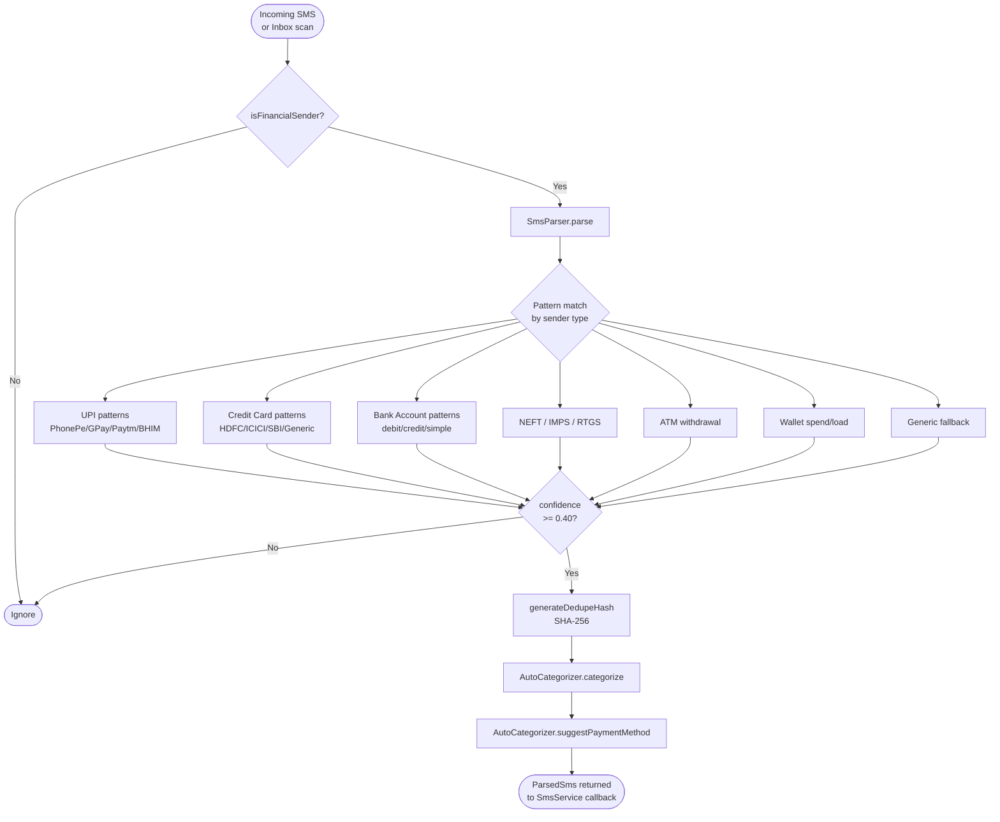
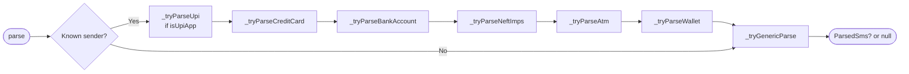
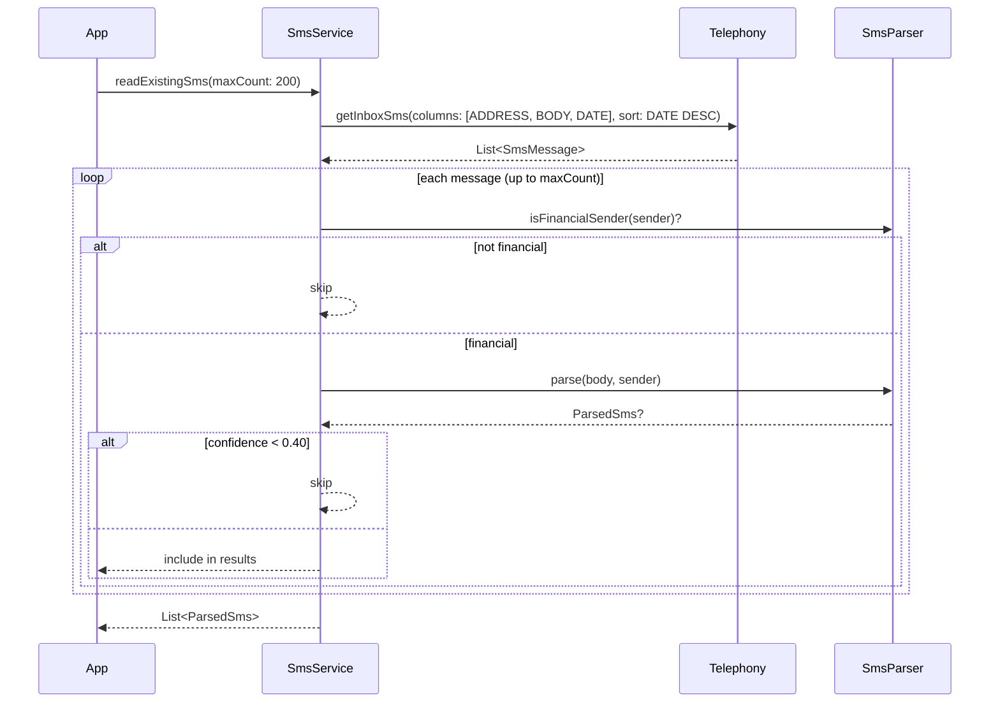

# SMS Pipeline — As Built

> Source-of-truth document generated from code inspection on 2026-03-27.  
> Files: `sms_parser.dart` (1 030 L), `sms_parser_service.dart` (32 L), `sms_service.dart` (143 L), `auto_categorizer.dart` (158 L)

---

## 1. End-to-End Pipeline



---

## 2. Component Map

| Class | File | Role |
|---|---|---|
| `SmsParser` | `sms_parser.dart` | Pure-static parse engine; all regex, no I/O |
| `SmsParserService` | `sms_parser_service.dart` | Injectable wrapper around `SmsParser` for Riverpod |
| `SmsService` | `sms_service.dart` | Android telephony integration; threshold filtering |
| `AutoCategorizer` | `auto_categorizer.dart` | Keyword-match category + payment method suggestion |

---

## 3. SmsParser

**Design:** Private constructor `SmsParser._()`. All methods are `static`. Zero state. Pure function namespace.

### 3.1 Sender Registry

46 entries in `_senderRegistry: Map<String, String>`.  
Normalization: `.toUpperCase()`, strip leading `[A-Z]{2}-` prefix (e.g. `AD-HDFCBK` → `HDFCBK`).

| Normalized ID(s) | Institution |
|---|---|
| `PHONEPE`, `PHPEPP` | PhonePe |
| `GPAY`, `GOOGLEPAY` | Google Pay |
| `PAYTM`, `PYTMPS` | Paytm |
| `UPIAPP`, `BHIM` | BHIM |
| `AMPAY`, `AZPUPI` | Amazon Pay |
| `HDFCBK` | HDFC Bank |
| `ICICIB` | ICICI Bank |
| `SBISEC`, `SBIBNK` | SBI |
| `AXISBK` | Axis Bank |
| `KOTAKB` | Kotak Bank |
| `PNBSMS` | PNB |
| `BOISMS`, `BOBSMS` | Bank of Baroda |
| `INDBNK` | IndusInd Bank |
| `HDFCCC` | HDFC Credit Card |
| `ICICIC` | ICICI Credit Card |
| `SBICRD` | SBI Credit Card |
| `AXISCC` | Axis Credit Card |
| `KOTAKC` | Kotak Credit Card |
| `PNBCC` | PNB Credit Card |
| `INDCC` | IndusInd Credit Card |
| `PAYTMW` | Paytm Wallet |
| `MOBIKW` | MobiKwik |
| `FREPAY` | Freecharge |
| `FIMONY`, `FIMNBY` | Fi Money |
| `SLICEP`, `SLICEB` | Slice |
| `JUPBNK`, `JUPITE` | Jupiter |
| `ONECRD`, `ONECRD1` | OneCard |
| `IDFCBK`, `IDFCFB` | IDFC First Bank |
| `YESBNK`, `YESBK` | Yes Bank |
| `RBLBNK` | RBL Bank |
| `CENTBK` | Central Bank of India |
| `CANBNK` | Canara Bank |
| `UNIONB` | Union Bank |
| `BANDAN` | Bandhan Bank |

### 3.2 Pre-compiled Regex Patterns

**Amount (3 patterns, tried in order):**
```
Rs\.?\s*(\d+(?:,\d+)*(?:\.\d{1,2})?)
₹\s*(\d+(?:,\d+)*(?:\.\d{1,2})?)
INR\s*(\d+(?:,\d+)*(?:\.\d{1,2})?)
```

**UPI reference (4 patterns):**
```
UPI\s*Ref\s*(?:No\.?|:)\s*(\w+)
UPI:\s*(\w+)
TxnID:\s*(\w+)
Txn\s*ID\s*:\s*(\w+)
```

**Available balance:**
```
(?:Avl\s*Bal|Available\s*[Bb]alance|Bal|A/c\s*bal)[\s:]*Rs\.?\s*(\d+(?:,\d+)*(?:\.\d{1,2})?)
```

**Date formats (4 patterns):**
```
(\d{2})-([A-Za-z]{3})-(\d{2,4})     → 24-Feb-26 or 24-Feb-2026
(\d{2})-(\d{2})-(\d{4})              → 24-02-2026
(\d{2})/(\d{2})/(\d{4})              → 24/02/2026
(\d{2})([A-Z]{3})\b                  → 24FEB
```
Two-digit years expanded by `year += 2000`.

### 3.3 Named Per-sender Patterns (pre-compiled `static final`)

| Pattern name | Matches | Groups |
|---|---|---|
| `_phonePeSent` | PhonePe debit | amount, party |
| `_phonePeReceived` | PhonePe credit | amount, party |
| `_gpaySent` | Google Pay debit | amount, party |
| `_gpayReceived` | Google Pay credit | party, amount |
| `_gpayReceivedAlt` | GPay alt credit (sender-gated) | amount, party |
| `_paytmSent` | Paytm debit | amount, party |
| `_bhimSent` | BHIM UPI debit | amount, party |
| `_genericUpiSent` | Generic UPI debit | amount, party |
| `_genericUpiReceived` | Generic UPI credit | amount, party |
| `_hdfcCc` | HDFC CC spend | amount, last4, merchant, date |
| `_iciciCc` | ICICI CC spend | last4, amount, merchant, date |
| `_sbiCc` | SBI Card spend | last4, amount, merchant |
| `_genericCcSpend` | Any CC spend | amount, last4, merchant |
| `_bankDebit` | Full bank debit | amount, last4, party |
| `_bankCredit` | Full bank credit | amount, last4, party |
| `_bankDebitSimple` | Simple bank debit | amount, last4 |
| `_bankCreditSimple` | Simple bank credit | amount, last4 |
| `_neftImps` | NEFT/RTGS/IMPS | amount, direction, type, party |
| `_atmWithdrawal` | ATM cash | amount, location |
| `_walletSpend` | Wallet debit | amount, wallet, party |
| `_walletLoad` | Wallet top-up | amount, wallet |

### 3.4 Parse Dispatch Order



**UPI app gating** — `_isUpiApp` set: `{PhonePe, Google Pay, Paytm, BHIM, Amazon Pay, Fi Money, Slice, Jupiter}`  
Generic UPI patterns only fire for senders in this set.

### 3.5 Confidence Scoring

Pure additive, range `[0.0, 1.0]`:

| Signal | Weight |
|---|---|
| amount > 0 (mandatory) | +0.40 |
| partyName non-null/non-empty | +0.30 |
| direction determined | +0.15 |
| referenceId non-null | +0.10 |
| date non-null | +0.05 |
| **Maximum** | **1.00** |

If `amount == 0` → returns `0.0` immediately (not routed further).  
`cardLast4` / `accountLast4` present in signature but **not scored**.

### 3.6 Deduplication Hash

```
SHA-256( "${amount}-${year}-${month}-${day}-${hour}-${minute}-${merchantKey}-${direction.name}-${refKey}" )
```

Where:  
- `merchantKey = partyName.toLowerCase().replaceAll(RegExp(r'\W'), '')`  
- `refKey = upiRefNo ?? referenceId ?? ''`

Two transactions with same amount + party + minute + reference → identical hash → deduplicated.

### 3.7 Party Name Cleaning

1. `trim()`
2. Strip trailing `.,;:`
3. Strip trailing `Pvt`, `Private`, `Ltd`, `Limited`, `Inc` (case-insensitive)
4. Normalize whitespace
5. Return `null` if < 2 chars or purely numeric

---

## 4. SmsParserService

Thin Riverpod-injectable wrapper — zero logic.

```dart
class SmsParserService {
  const SmsParserService();
  bool isFinancialSender(String sender)        // → SmsParser.isFinancialSender
  ParsedSms? parse(String body, String sender) // → SmsParser.parse
  String generateDedupeHash(ParsedSms parsed)  // → SmsParser.generateDedupeHash
}
```

Injected via `smsParserProvider` in Riverpod. Enables unit-test mocking without touching `SmsParser` directly.

---

## 5. SmsService

Handles Android telephony integration. All methods short-circuit on web or non-Android via:
```dart
bool get _smsUnsupported => kIsWeb || !Platform.isAndroid;
```

### Inbox Scan (`readExistingSms`)



### Live Listener

```dart
typedef OnTransactionSmsDetected = void Function(ParsedSms parsedSms);

void startListening({required OnTransactionSmsDetected onTransactionDetected})
void stopListening()
```

Same pre-filter (sender check + confidence ≥ 0.40) applied in `_handleIncomingSms`.  
Background handler (`@pragma('vm:entry-point')`) logs only — full processing happens when app resumes.

### Confidence Threshold

**Hard threshold: 0.40** — applied in both inbox scan and live listener.  
A transaction with amount but no party/ref (minimum score: 0.55) always passes. A transaction where only amount is extracted (0.40) also passes.

---

## 6. AutoCategorizer

**Design:** Private constructor, all methods `static`. Pure function namespace.

### Expense Category Keyword Map

9 categories, keyword count per category:

| Category | Keyword count | Sample keywords |
|---|---|---|
| Food & Dining | 23 | `swiggy`, `zomato`, `restaurant`, `dominos`, `kfc` |
| Transportation | 22 | `uber`, `ola`, `rapido`, `petrol`, `fastag`, `irctc`, `indigo` |
| Shopping | 15 | `amazon`, `flipkart`, `myntra`, `ajio`, `meesho`, `nykaa` |
| Bills & Utilities | 22 | `electricity`, `jio`, `airtel`, `emi`, `insurance`, `rent` |
| Healthcare | 15 | `hospital`, `pharmacy`, `apollo`, `medplus`, `1mg`, `diagnostic` |
| Entertainment | 14 | `netflix`, `hotstar`, `pvr`, `bookmyshow`, `spotify` |
| Groceries | 14 | `bigbasket`, `blinkit`, `zepto`, `dmart`, `jiomart` |
| Education | 15 | `school`, `byju`, `udemy`, `coursera`, `coaching` |
| Business Expense | 13 | `vendor`, `wholesale`, `inventory`, `logistics`, `courier` |

### Income Category Keyword Map

5 categories:

| Category | Keywords |
|---|---|
| Salary | `salary`, `wage`, `pay`, `stipend`, `compensation` |
| Business Income | `business`, `revenue`, `sale`, `customer`, `payment received` |
| Freelance | `freelance`, `consulting`, `project`, `contract` |
| Investment | `dividend`, `interest`, `mutual fund`, `stock`, `fd`, `rd`, `sip` |
| Refund | `refund`, `return`, `cashback`, `reversal`, `chargeback` |

### Categorize Logic

```
searchText = "${partyName.toLowerCase()} ${smsBody.toLowerCase()}"

if parsed.isCredit:
    → iterate _incomeKeywords, pick highest matchScore
    → special: bankAccount/neft/imps + "salary"/"sal " in body → force 'Salary'
    → default: 'Other Income'
else:
    → iterate _expenseKeywords, pick highest matchScore
    → special: sourceType == ATM → always 'Other' (overrides all keywords)
    → default: 'Other'
```

`_matchScore`: count of matching keywords via `String.contains()`. No weighting. First-in-map wins ties.

### Payment Method Suggestion

| `SmsSourceType` | Suggested method |
|---|---|
| `upi` | `UPI` |
| `creditCard` | `Credit Card` |
| `debitCard` | `Debit Card` |
| `atm` | `Cash` |
| `wallet` | `Wallet` |
| `neft`, `rtgs`, `imps`, `bankAccount` | `Net Banking` |
| `unknown` | `UPI` (default — most common in India) |

---

## 7. ParsedSms Model

Key output fields populated by the pipeline:

| Field | Type | Source |
|---|---|---|
| `amount` | `double` | Regex extraction (Rs/₹/INR) |
| `partyName` | `String?` | Pattern-specific capture group |
| `direction` | `TransactionDirection` | Pattern type (sent/received) |
| `upiRefNo` | `String?` | UPI ref pattern |
| `referenceId` | `String?` | Generic ref pattern |
| `date` | `DateTime?` | Date pattern |
| `cardLast4` | `String?` | `XX(\d{4})` pattern |
| `accountLast4` | `String?` | `XX?(\d{4})` bank pattern |
| `availableBalance` | `double?` | Avl Bal pattern |
| `sourceType` | `SmsSourceType` | Set by each `_tryParse*` method |
| `institution` | `String?` | From sender registry |
| `confidence` | `double` | `_calculateConfidence()` |
| `dedupeHash` | `String` | SHA-256 composite |
| `suggestedCategory` | `String` | `AutoCategorizer.categorize()` |
| `suggestedPaymentMethod` | `String` | `AutoCategorizer.suggestPaymentMethod()` |

---

## 8. Key Limitations

1. **Android only** — `SmsService` does not run on iOS or web.
2. **46 sender IDs registered** — new banks/apps require adding their sender ID to `_senderRegistry`.
3. **Generic fallback only fires for unknown senders** — known senders that don't match any pattern return `null` (not routed to generic).
4. **No ML** — categorization is pure keyword frequency; no TF-IDF, no embeddings.
5. **ATM transactions** lose category detail — hard-coded to `'Other'` regardless of merchant keywords.
6. **Debit card note** — `_bankDebit` with `Via Card at {party}` correctly identifies debit card spend, but `SmsSourceType.debitCard` requires card-specific patterns; some banks group it under `bankAccount`.
