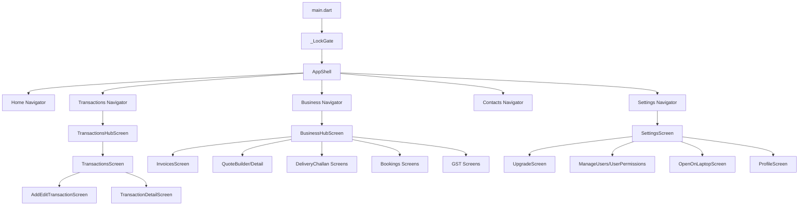

# State Management and Navigation (As-Built)

## 1) Riverpod Inventory

From `lib/presentation/providers/`:

- Provider files: **50**
- `Provider`: 56
- `StateProvider`: 22
- `FutureProvider`: 88
- `StreamProvider`: 7
- `StateNotifierProvider`: 47
- `NotifierProvider`: 1
- `AsyncNotifierProvider`: 3

## 2) Provider Domains

### Core domain providers
- `transaction_provider.dart`
- `credit_provider.dart`
- `loan_provider.dart`
- `invoice_provider.dart`
- `booking_provider.dart`
- `business_provider.dart`
- `staff_provider.dart`

### Platform/session/auth providers
- `app_user_provider.dart`
- `identity_provider.dart`
- `context_provider.dart`
- `deep_link_provider.dart`
- `terms_provider.dart`

### Sync and live-refresh providers
- `p2p_provider.dart`
- `web_sync_provider.dart`
- `sync_auto_refresh_provider.dart`

### UI workflow providers
- `dashboard_provider.dart`
- `report_provider.dart`
- `upcoming_provider.dart`
- `tutorial_flow_provider.dart`
- `notification_provider.dart`

## 3) Navigation Surface (69 screen files)

Top-level screen folders under `lib/presentation/screens/`:

- `auth/`
- `bills/`
- `bookings/`
- `business/`
- `contacts/`
- `gst/`
- `home/`
- `inventory/`
- `invoices/`
- `ledger/`
- `loans/`
- `notifications/`
- `onboarding/`
- `parties/`
- `recurring/`
- `reports/`
- `search/`
- `settings/`
- `staff/`
- `transactions/`

## 4) Runtime Navigation Diagram

## 5) AppShell Mechanics (Implementation Notes)

`AppShell` behavior in code:

- Maintains per-tab navigator stack via dedicated keys.
- Resets target tab to root on tab switch when needed.
- Intercepts back press and delegates to active tab navigator.
- Displays `ContextBannerWidget` for linked-session context.
- Applies role-based tab access checks via permissions provider.
- Listens to deep-link and SMS confirmation providers for live overlays.

## 6) UX Composition Signals

The existing screen set suggests these implemented product areas:

1. Full invoice/quote/challan lifecycle
2. Booking + customer flow
3. Inventory + stock + lots
4. GST reporting and purchase bill management
5. Team/user permission management
6. Web companion and sync controls

So current UX scope is materially broader than a simple finance tracker.
