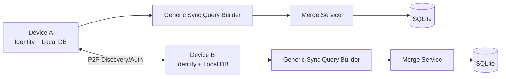
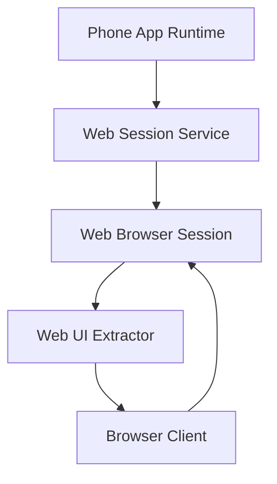

# Sync and Identity (As-Built)

## 1) Sync/Identity Service Inventory

From `lib/data/services/`:

### P2P sync services
- `p2p/p2p_auth_service.dart`
- `p2p/p2p_client.dart`
- `p2p/p2p_coordinator.dart`
- `p2p/p2p_discovery_service.dart`
- `p2p/p2p_merge_service.dart`
- `p2p/p2p_server.dart`

### Generic sync engine services
- `sync/generic_sync_query_builder.dart`
- `sync/sync_table_registry.dart`
- `sync/sync_table_state_store.dart`
- `sync_event_bus.dart`

### Web companion services
- `web/web_browser_session.dart`
- `web/web_session_service.dart`
- `web/web_ui_extractor.dart`

### Identity/session core
- `identity_service.dart`
- `plan_gate.dart`

## 2) Data Backbone for Sync

Sync/identity DB tables currently present:

- `my_identity`
- `linked_devices`
- `linked_business_sessions`
- `device_session`
- `trusted_peers`
- `sync_outbox`
- `sync_watermarks`
- `sync_table_state`
- `pairing_history`
- `device_recovery`
- `invoice_events`

This indicates the system is built as a **multi-context local-first sync architecture**, not a single-device-only app.

## 3) High-Level Sync Topology

## 4) Browser Companion Topology

## 5) Sync Model Characteristics (from code shape)

1. **Table-driven sync state** (`sync_table_state`) instead of fragile one-off state variables.
2. **Watermark-aware progression** (`sync_watermarks`) per peer/table.
3. **Event-friendly updates** (`sync_event_bus`, `invoice_events`) for incremental propagation and audit.
4. **Identity-linked sessions** (`my_identity`, `linked_business_sessions`) that support context-specific data views.
5. **Plan/permission gating hooks** (`plan_gate`, app user permissions) for scoped behavior.

## 6) Operational Implications

- The app has enough sync infrastructure to support offline-first, session-scoped linked device usage.
- Identity and permissions are first-class entities in the codebase, not a future placeholder.
- Documentation and QA should treat sync behavior as core architecture, not an experimental extension.
