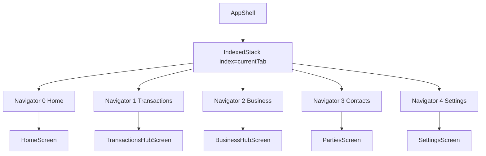

# App Shell and Navigation (As-Built)

Primary source:
- `lib/presentation/app_shell.dart`
- `lib/core/extensions/context_extensions.dart`

---

## 1) Shell Composition

`AppShell` is a stateful coordinator that combines:

- 5-tab root navigation
- per-tab nested navigators (stack isolation)
- adaptive nav chrome (`NavigationRail` vs `NavigationBar`)
- global overlays (context banner, web connection banner, SMS badge/sheet, deep-link sheet)
- role-based access checks for non-owner users

### Tabs

| Index | Root screen |
|---|---|
| 0 | `HomeScreen` |
| 1 | `TransactionsHubScreen` |
| 2 | `BusinessHubScreen` |
| 3 | `PartiesScreen` |
| 4 | `SettingsScreen` |

---

## 2) Navigator Topology

### Why this design

- Each tab has dedicated `NavigatorState` key (`_tabNavKeys`), preserving tab-local history.
- `_tabScreens` are created once in `initState` and reused to avoid transient unmount/remount side effects during shell rebuilds.

---

## 3) Adaptive Layout Rules

From `context_extensions.dart`:
- `isExpanded` when width >= 840dp

AppShell behavior:
- `isExpanded == true` → `NavigationRail` + vertical divider + content
- else → bottom `NavigationBar`

FAB visibility:
- shown only for tabs 0,1,2 (Home, Transactions, Business)
- hidden when active tab navigator can pop (`subRouteActive`)

---

## 4) Back Navigation Contract

Shell is wrapped in `PopScope(canPop: false)`.

On back press:
1. If active tab navigator can pop: pop tab route
2. Else: `SystemNavigator.pop()` (close/minimize app)

This makes shell itself non-poppable and delegates navigation to tab stacks.

---

## 5) Tab Switch Behavior

`handleTabSelected(screenIndex)` implements:

1. **Same tab tapped**:
   - pop that tab to root if nested route exists
2. **Different tab selected**:
   - pre-pop target tab to root (if it has deep stack)
   - then evaluate permission and switch

This ensures a tab click always lands on the hub/root for that module.

---

## 6) Role-Aware Module Access

For staff users (`activeAppUserProvider != null`), tab-level module checks are applied:

| Tab | Module check |
|---|---|
| Home | `PermissionModule.transactions` |
| Transactions | `PermissionModule.transactions` |
| Business | `PermissionModule.invoices` |
| Contacts | `PermissionModule.credits` |
| Settings | no module check |

Denied access path:
- show SnackBar: "You don't have access to this section."
- keep current tab unchanged

---

## 7) Event Integrations in Shell

### 7.1 Deep links + install referrer

Sources:
- Android install referrer channel (`AppConfig.installReferrerChannel`)
- `AppLinks.getInitialLink()`
- `AppLinks.uriLinkStream`

Flow:
1. URI/referrer decoded to vCard payload
2. payload stored in `pendingDeepLinkVCardProvider`
3. listener consumes value once and opens `PartyFormSheet` with prefilled `Party`

### 7.2 SMS real-time confirmations

Flow:
1. listener starts only when:
   - platform is mobile
   - SMS permission granted
   - `smsAutoDetectEnabledProvider == true`
2. incoming parsed SMS is dedupe-checked via `SmsParser.generateDedupeHash`
3. `pendingSmsConfirmationsProvider` updated
4. confirmation sheet shown (`showSmsConfirmationSheet`)
5. edit path pushes `AddEditTransactionScreen` with prefilled `Transaction`

Badge:
- pending SMS count is shown on Home tab destination icon

### 7.3 Scheduled auto-creations

On first frame: `_processRecurringTransactions()` → `processScheduledAutoCreations(ref)`

---

## 8) Web-specific Shell Layer

When `kIsWeb`:
- `WebConnectionBanner` wraps main `IndexedStack` content
- deep-link/SMS listener startup path is skipped

---

## 9) Observer and Rebuild Semantics

Each tab navigator has `_StackObserver` that triggers shell `setState` on:
- push
- pop
- remove
- replace

Purpose:
- keeps FAB visibility synchronized with active stack depth

---

## 10) Navigation Guarantees

1. Root tab identity is stable across rebuilds.
2. Tab stacks are isolated and preserved unless explicitly popped-to-root.
3. Back press semantics are deterministic and shell-owned.
4. Cross-cutting overlays (context, web status, SMS/deep-link) are globally composable without leaving shell context.
