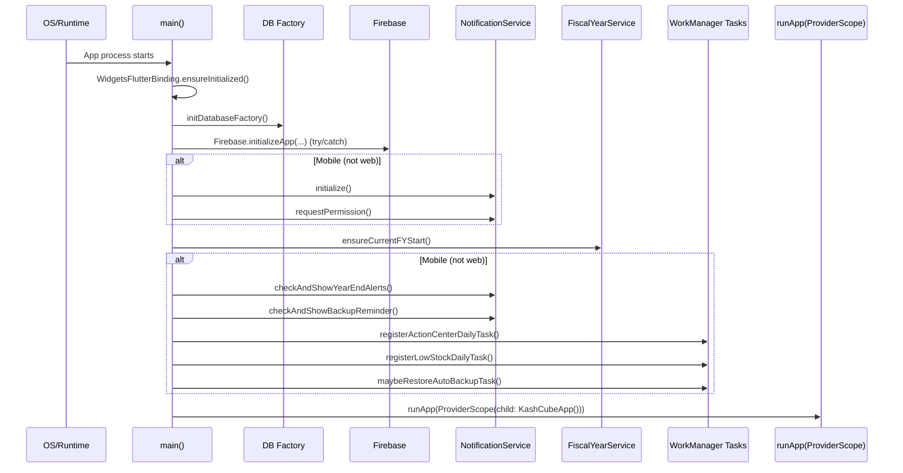
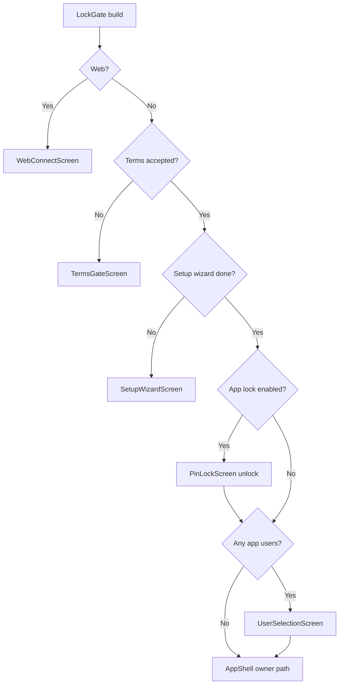

# Boot and Startup (As-Built)

Primary sources:
- `lib/main.dart`
- `lib/presentation/providers/settings_provider.dart`
- `lib/presentation/providers/app_user_provider.dart`
- `lib/presentation/providers/terms_provider.dart`

---

## 1) Startup Timeline (`main()`)

### Key properties

- Startup is **defensive and non-fatal**:
  - Firebase init failure is logged and ignored (`debugPrint`), app continues.
  - Pre-`runApp()` initialization is wrapped in try/catch; failures do not block first frame.
- `runApp()` is guaranteed to execute even when optional subsystems fail.

---

## 2) Platform Branches at Boot

| Concern | Web | Mobile |
|---|---|---|
| DB backend setup | Uses `initDatabaseFactory()` (web factory branch) | Uses native SQLite branch |
| Firebase init | Attempted | Attempted |
| Analytics collection gating | Enabled for web session | Controlled by `SettingsKeys.analyticsConsent` |
| Local notifications | Skipped | Initialized + permission request |
| WorkManager background tasks | Skipped | Registered/restored |
| `_LockGate` path | direct to `WebConnectScreen` | Terms + setup + lock + user selection gates |

---

## 3) App Root Runtime Installers (`KashCubeApp`)

In `build()`:

- `ref.watch(syncAutoRefreshInstallerProvider)`
  - installs table-change event listener → provider invalidation map
- Mobile-only:
  - `ref.watch(notificationSchedulerProvider)`
  - `ref.watch(iapServiceProvider)`

This makes root widget an **installer shell** for long-lived reactive processes.

---

## 4) `_LockGate` Decision Graph

### Gate semantics

1. **Web short-circuit**: web uses companion/session model, bypasses PIN/user-selection flow.
2. **Terms gate** before setup/lock logic.
3. **Setup wizard** gate before lock/user selection.
4. **PIN lock** enforced if `app_lock_enabled=true`.
5. **User selection** only when staff users exist; owner can still proceed.

---

## 5) `_LockGate` Lifecycle Hooks

### `initState`
- Registers `WidgetsBindingObserver`
- Runs `_checkLock()`

### `didChangeAppLifecycleState`
- `paused` (mobile): performs `PRAGMA wal_checkpoint(PASSIVE)` through `DatabaseHelper`
  - ensures WAL state is checkpointed before backup/background transitions
- `resumed`: if previously unlocked
  - evicts stale PDFs via `PdfCacheManager.evict()` (mobile)
  - re-runs `_checkLock()` (re-lock on resume)

### `_checkLock()`
- reads `SettingsKeys.appLockEnabled`
- sets internal `_isLocked` / `_checkedLock`
- triggers biometric attempt when lock active

### `_attemptBiometric()`
- mobile-only path using `LocalAuthentication`
- gated by `SettingsKeys.biometricEnabled`
- non-fatal on cancellation/failure; falls back to PIN UI

---

## 6) User Session Model at Boot

| State | Meaning |
|---|---|
| `activeAppUserProvider == null` | Owner context (full access) |
| `activeAppUserProvider != null` | Staff context (permission-scoped) |

Additional session switches:
- `switchUserProvider` listener in `_LockGate` resets active user and returns to selection gate.

---

## 7) Reliability Guarantees at Startup

1. No optional subsystem can block first frame.
2. Terms/setup/auth gates are deterministic and ordered.
3. Resume path re-applies lock policy and cache hygiene.
4. Startup side effects (notifications/tasks/FY checks) are explicit and centralized in `main()`.

---

## 8) Startup Failure Matrix

| Failure point | Outcome |
|---|---|
| Firebase config missing | Analytics disabled, app continues |
| Notification init fails | Logged, app continues |
| WorkManager registration fails | Logged, app continues |
| FY check fails | Logged, app continues |
| Biometric auth fails/cancelled | User uses PIN path |
