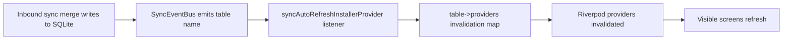

# Runtime Cross-Cutting Concerns (As-Built)

Primary sources:
- `lib/main.dart`
- `lib/presentation/app_shell.dart`
- `lib/presentation/providers/sync_auto_refresh_provider.dart`
- `lib/presentation/providers/notification_provider.dart`
- `lib/data/services/pdf_cache_manager.dart`

---

## 1) Cross-Cutting Runtime Matrix

| Concern | Bootstrap point | Runtime owner | Scope |
|---|---|---|---|
| Sync freshness | `KashCubeApp.build` | `syncAutoRefreshInstallerProvider` | app-wide |
| Notification scheduling | `KashCubeApp.build` (mobile) | `notificationSchedulerProvider` + `NotificationService` | app-wide |
| In-app purchase listener | `KashCubeApp.build` (mobile) | `iapServiceProvider` | app-wide |
| App lock / user session gate | `_LockGate` | `_LockGateState` + app user providers | startup + resume |
| Deep links + install referrer | `AppShell.initState` (mobile) | `AppLinks` + deep-link providers | foreground/runtime |
| SMS live ingestion | `AppShell.initState` + listener | SMS service + confirmation providers | foreground/runtime |
| PDF temp cache hygiene | `_LockGate.didChangeAppLifecycleState(resumed)` | `PdfCacheManager` | lifecycle |
| DB WAL safety checkpoint | `_LockGate.didChangeAppLifecycleState(paused)` | `DatabaseHelper` | lifecycle |

---

## 2) Sync Freshness Guarantee

### Why it matters

Without this installer, sync writes bypass UI notifiers and stale data can persist until manual refresh.

---

## 3) Lifecycle Safety Hooks

### On app pause
- runs `PRAGMA wal_checkpoint(PASSIVE)`
- reduces chance of backup/restore inconsistency due to pending WAL pages

### On app resume
- if previously unlocked:
  - evict stale/excess PDFs (`PdfCacheManager.evict()`)
  - re-evaluate lock status (`_checkLock()`)

This creates a security + storage hygiene checkpoint around app lifecycle transitions.

---

## 4) Deep Link Ingestion Surfaces

Three ingress paths are implemented:

1. install referrer (Android only, consumed once via shared pref key)
2. initial link on cold start
3. link stream while app is running

All normalize into same payload path:
- decode URI/referrer -> set `pendingDeepLinkVCardProvider` -> shell listener opens party form

This avoids divergent deep-link handling logic by channel.

---

## 5) SMS Runtime Pipeline Integration

`AppShell` dynamically controls listener based on settings + permissions:

- start only if permission granted and auto-detect enabled
- stop when auto-detect setting turns off
- dedupe hash check before surfacing confirmation

UI side effect path:
- pending confirmation provider state
- sheet-based user decision (`confirm`, `edit manually`, `dismiss`)
- optional navigation to prefilled add/edit transaction screen

---

## 6) Notification Runtime Coupling

Notifications are not fire-and-forget at startup; they are coupled to provider state:

- `upcomingItemsProvider` changes trigger `scheduleUpcomingNotifications(items)`
- startup also performs policy checks (year-end, backup reminders) on mobile

This gives both:
- reactive schedule correctness
- policy-driven nudges

---

## 7) Failure Tolerance Strategy

| Subsystem | Failure behavior |
|---|---|
| Firebase/analytics init | non-fatal, app proceeds |
| Notification init | non-fatal, app proceeds |
| WorkManager registration | non-fatal, app proceeds |
| Biometric auth | fallback to PIN flow |
| Install referrer read | silently ignored when unavailable |
| Deep-link parsing | ignored if payload invalid |

System philosophy: **degrade feature, never block core app launch**.

---

## 8) Operational Risks and Existing Mitigations

| Risk | Existing mitigation |
|---|---|
| UI stale after sync | table-to-provider invalidation map + broad fallback |
| Startup freeze due to optional service failure | try/catch wraps pre-runApp init path |
| Overgrown temp PDF cache | resume-time `PdfCacheManager.evict()` |
| Backup inconsistency under WAL | pause-time checkpoint |
| Permission bypass in tab switch | module check in shell before index mutation |

---

## 9) Suggested Maintenance Rule

When adding a new syncable table or feature pipeline:

1. add table to `AppTables`
2. map table to affected providers in `sync_auto_refresh_provider.dart`
3. document runtime ownership path in this file (bootstrap point + runtime owner)
