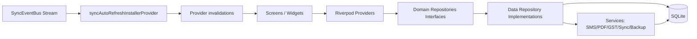
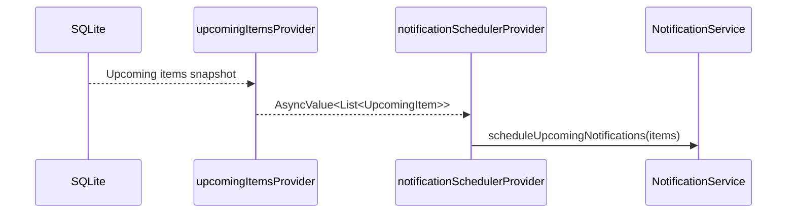

# State and Dataflow Architecture (As-Built)

Primary sources:
- `lib/presentation/providers/sync_auto_refresh_provider.dart`
- `lib/presentation/providers/app_user_provider.dart`
- `lib/presentation/providers/notification_provider.dart`
- `lib/presentation/providers/settings_provider.dart`
- `lib/presentation/app_shell.dart`

---

## 1) Layered Runtime Dataflow



Core model: **UI is cache/view state over provider graph; provider graph is refreshed by explicit events and repository reads.**

---

## 2) Provider Roles by Responsibility

### Session & identity state
- `activeAppUserProvider` (`StateProvider<AppUser?>`)
- `switchUserProvider` (selection reset signal)
- `hasAnyAppUserProvider` (`FutureProvider<bool>`)
- `permissionProvider` (`Provider.family<Future<Permission>>`)

### Configuration state
- `themeModeProvider`
- `defaultAccountIdProvider`
- `appLockEnabledProvider`
- `biometricEnabledProvider`
- settings-backed keys in `SettingsKeys`

### Runtime installers
- `syncAutoRefreshInstallerProvider`
- `notificationSchedulerProvider`

### Domain state providers (examples)
- transactions / credits / loans / invoices / bookings / staff / inventory / purchase bills

---

## 3) Sync-Aware UI Refresh Strategy

`syncAutoRefreshInstallerProvider` listens to `SyncEventBus.instance.stream` and invalidates mapped providers.

### Mapping model

- table name -> list of affected providers
- unknown table names -> broad fallback invalidation set

This gives:
1. targeted refresh for known tables (performance + correctness)
2. safe refresh fallback for newly introduced sync tables

### Table map pattern

```text
AppTables.transactions -> transactionsProvider + dashboards + balances
AppTables.credits      -> credit summaries/providers
AppTables.loans        -> loans + party summaries
AppTables.settings     -> theme/business/sms/default account providers
...
```

This is a **declarative invalidation map**, not switch-case logic.

---

## 4) Permissions and Role Model

Permission resolution is asynchronous and user-context aware.

- owner (`activeAppUserProvider == null`) => `Permission.full`
- staff => fetch module+business scoped permission via repository

This model is consumed in shell tab access and can be reused in feature widgets.

---

## 5) Notification Scheduling Dataflow

`notificationSchedulerProvider` watches `upcomingItemsProvider`.



Result: scheduled notifications stay aligned with actual upcoming item set.

---

## 6) Settings as Control Plane

`SettingsKeys` define runtime behavior switches for:

- auth and lock (`pin_hash`, `app_lock_enabled`, `biometric_enabled`)
- theme and personalization (`theme_mode`, owner profile fields)
- legal gating (`terms_accepted_version`, `terms_accepted_at`)
- onboarding/tutorial completion markers
- analytics consent
- FY/document terms/document template defaults
- subscription tier and feature switches

Architecture implication: **small key-value mutations can alter major runtime paths (startup gates, analytics, shell behavior).**

---

## 7) Shell as Event Hub over Provider Graph

`AppShell` demonstrates orchestration style used across app:

1. listen to provider/event
2. evaluate guard conditions
3. perform side effect (navigate/show sheet/start listener)
4. update provider state

Examples:
- pending deep-link vCard -> open prefilled `PartyFormSheet`
- pending SMS confirmation -> open confirmation/add-edit flow
- SMS auto-detect setting change -> start/stop listener dynamically

---

## 8) Consistency Guarantees

1. Sync-merged rows become visible through provider invalidation (without manual refresh).
2. Permission checks are centralized at repository/provider layer.
3. Notification schedules derive from provider state, not ad-hoc screen actions.
4. Startup installers (`KashCubeApp`) ensure cross-cutting runtime systems are activated once at root.
